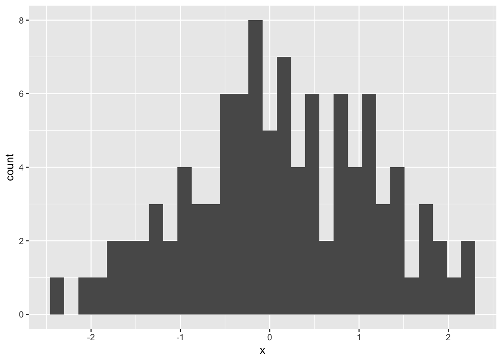
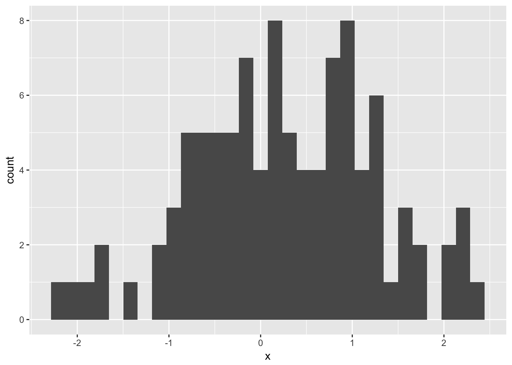
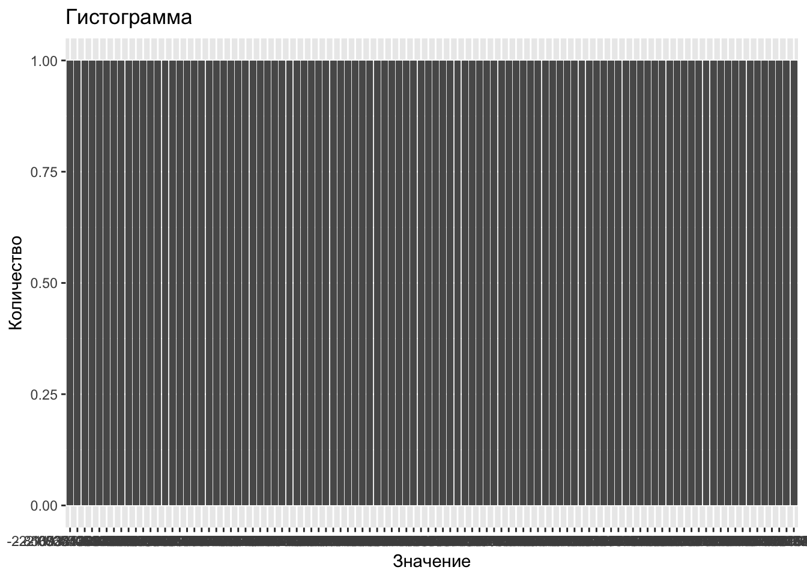
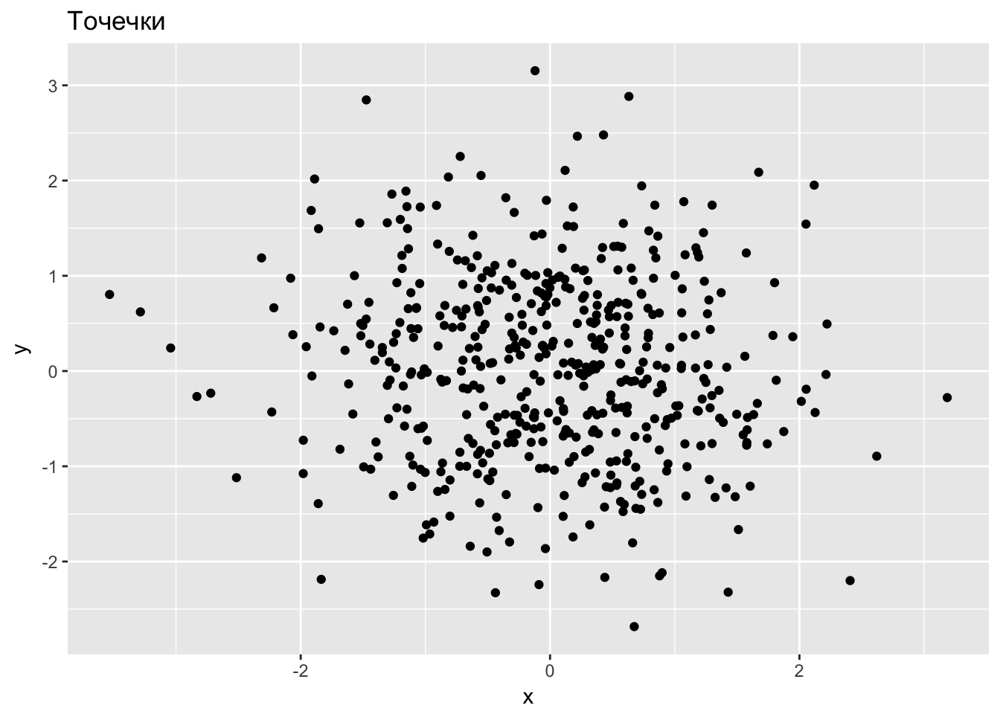

# Первые шаги {#first_steps}

> Поехали!
>
> Алексей Гагарин

## Установка софта {#installation}

Казалось бы, чего проще — поставить программу?! Однако не всегда всё идёт
гладко, поэтому подробности в студию:

### Россия — родина слонов {#russia}

В России проблем не две, как думают многие, а три: дураки, дороги и русские буквы в именах файлов. Самая распространённая проблема, с которой мне доводилось бороться не один раз, — это русские буквы и пробелы в названиях файлов и папок под
Windows.

<div class="warning">
<p>Если ты используешь Windows, то никогда при серьёзной работе не используй русские буквы и пробелы в названиях файлов и папок.</p>
</div>

Папку с котиками можно оставить под названием `мои котики` :)

Заповедь о русских буквах легко нарушить даже не осознавая этого. Если имя пользователя Windows написано русскими буквами, например, `Машенька`, то по умолчанию все документы этого пользователя будут находиться в папке `C:/Users/Машенька/Documents/`.


<div class="warning">
<p>Для серьёзной работы под Windows нужно создать нового пользователя с английским именем, например, <code>Mashenka</code>.</p>
</div>

Переименование старого пользователя не помогает, проверено. После создания нового пользователя можно перенести документы из старой папке `C:/Users/Машенька/Documents/` в новую `C:/Users/Mashenka/Documents/`.

Правильное имя пользователя без пробелов и русских букв __значительно__ снижает риск дальнейших проблем.


## Набор легковооружённого кавалериста {#light_setup}

Набор легковооружённого кавалериста включает в себя всего две программы, [R](https://cran.r-project.org/) и [Rstudio](https://rstudio.com/). Лишь в небольшой части разделов этого учебника тебе потребуется установка дополнительного софта.

R — это язык программирования ориентированный на статистический анализ данных, а Rstudio — гламурная графическая оболочка к R. Rstudio не может работать без R. Никаких принципиально новых возможностей Rstudio к R не добавляет, но здорово упрощает жизнь!


### R {#install_R}

Устанавливаем R.

#### R под Windows:

1. Заходим на [официальный сайт](https://cran.r-project.org/)

2. Кликаем `Download R for Windows`

3. Выбираем `base`. Это не какая-то ограниченная, базовая версия, а самая настощая полная версия R.

4. Кликаем `Download R 3.3.x for Windows`

5. Запускаем установщик.

6. На вопрос установщика, куда устанавливать R, указываем папку `C:\R`.

Проблема в том, что по умолчанию R ставится в папку `C:\Program files\...`. В имени папки есть пробел, который иногда приводит к проблемам. Чтобы не играть в лотерею с проблемами, лучше выбрать папку `C:\R` или любую другую без русских букв и пробелов.

#### R под Macos:

1. Заходим на [официальный сайт](https://cran.r-project.org/)

2. Кликаем `R-3.3.x.pkg`

3. Запускаем установщик.

Раньше при установке R пользователь должен был выбрать зеркало, с которого скачивать R. Это пугало новичков! Разработчики не сразу поставили автоматический выбор зеркала. Выбор ещё остался при установке пакетов. Можно смело брать любое, например, самое первое, `0-cloud`.

#### R под linux

Linux на примере Ubuntu 16.04 Xenial:

```bash
sudo echo "deb http://cran.rstudio.com/bin/linux/ubuntu xenial/" | sudo tee -a /etc/apt/sources.list
gpg --keyserver keyserver.ubuntu.com --recv-key E084DAB9
gpg -a --export E084DAB9 | sudo apt-key add -
sudo apt-get update
sudo apt-get install r-base r-base-dev
```

### Установка R для суровых челябинцев {#r_chelyabinsk}

Вместо классического R можно поставить конкурирующий [дистрибутив R от Microsoft](https://mran.microsoft.com/download/), MRO. Отличия MRO от классического R:

1. Работает только с 64-битным процессором

1. Использует быструю библиотеку MKL для операций с матрицами

1. По умолчанию ставит не самые свежие пакеты, а версии пакетов, выпущенные на заданную дату. Это удобная особенность позволяет легко воспроизвести результаты работы, даже если какой-нибудь пакет кардинально изменился.

Суровые челябинские мужики могут самостоятельно настроить R на использование  быстрых библиотек для матричных операций:

Macos: настраиваем оптимизированную под мак библиотеку:

```bash
cd /Library/Frameworks/R.framework/Resources/lib
ln -sf /System/Library/Frameworks/Accelerate.framework/Frameworks/vecLib.framework/Versions/Current/libBLAS.dylib libRblas.dylib
```

Macos: восстанавливаем дефолтную библиотеку R:

```bash
cd /Library/Frameworks/R.framework/Resources/lib
ln -sf libRblas.0.dylib libRblas.dylib
```

На линуксе можно поэкспериментировать с [выбором разных BLAS](http://edustatistics.org/nathanvan/2013/07/09/for-faster-r-use-openblas-instead-better-than-atlas-trivial-to-switch-to-on-ubuntu/)


### Rstudio {#install_Rstudio}

Оболочка Rstudio открытая и бесплатная. Есть платная версия Rstudio, платной в ней является круглосуточная поддержка пользователей. И иногда оболочку Rstudio путают с программой для восстановления данных R-studio, которая полностью платная.

1. Скачиваем 
[текущую версию Rstudio Desktop](https://www.rstudio.com/products/rstudio/download/).

2. Запускаем установщик.

3. Под Windows на вопрос установщика, куда устанавливать Rstudio, указываем папку `C:\Rstudio`.

Проблема с Rstudio потенциально та же, что и с R: могут возникнуть трудности при использовании папки с русскими буквами и пробелами, а по умолчанию Rstudio ставится в `C:\Program Files\...`.


Любители заглянуть вперёд и опробовать новые фишки могут [поставить preview-версию Rstudio](https://www.rstudio.com/products/rstudio/download/preview/). Теоретически подобная бета-версия может быть менее устойчивой, чем обычная. По моему опыту никаких проблем со стабильностью в preview-версии не было, а приятные плюшки, ещё не вошедшие в текущую версию, есть :)


#### Настройка Rstudio:

1. Заходим в Tools - Global options - General:

- Убираем галочку `Restore .Rdata into workspace at startup`.

- В разделе `Save workspace to .Rdata on exit` выбираем `Never`

Rstudio по умолчанию при выходе сохраняет все объекты в памяти в файл, который затем подгружается при старте. Это плохая привычка. Постепенно в этом `.Rdata` файле будет накапливаться мусор. Рано или поздно мусора станет так много, что либо загрузка Rstudio будет занимать немерено времени, либо при загрузке будет происходить ошибка.

2. Заходим в `Tools` - `Global options` - `Sweawe`:

- В разделе `Weave .Rnw files using` выбираем `knitr`.

Для связи R с \LaTeX мы будем использовать более передовой `knitr`. Первопроходец Sweave сделал прекрасную работу, и его подвиги мы будем помнить и чтить :)

3. Заходим в `Tools` - `Global options` - `Code` - `Diagnostics`:

- Выставляем все галки!

Настоящие леди и джентельмены, а также синьоры и синьориты, пишут стильный код!


## Тяжёловооружённая кавалерия {#other_programs}

Помимо минимального набора из R и Rstudio любопытный читатель может ознакомиться с другими полезными программами. Для этих программ я привожу скорее ссылки, а не пошаговые инструкции по установке.


### LaTeX {#install_Latex}

\LaTeX — это система для создания красивых структурированных текстов. Читается «Латех». Пользоваться Вордом для написания курсовых или научных статей — это дурной вкус.

\LaTeX дарит возможность писать красивые математические формулы. В силу  простоты текстового формата для хранения документов \LaTeX идеально подходит для взаимодействия с другими программами. Связав R и \LaTeX с помощью грамотного программирования, можно в один клик обновлять сложные отчёты при получении новых данных или избегать ошибок, связанных с копированием результатов вычислений в презентацию.

Под Linux основной дистрибутив \LaTeX — это TeXLive. Лучше всего поставить [свежую версию TeXLive руками](https://www.tug.org/texlive/acquire-netinstall.html).

После ручной инсталляции нам надо убедить Ubuntu, что ей не надо ставить \LaTeX из своего репозитория:

```bash
sudo apt-get install equivs freeglut3
mkdir -p /tmp/tl-equivs && cd /tmp/tl-equivs
wget http://www.tug.org/texlive/files/debian-equivs-2016-ex.txt
cp -f debian-equivs-2016-ex.txt texlive-local
equivs-build texlive-local
sudo dpkg -i texlive-local_2016-2_all.deb
```


Под Macos основной дистрибутив \LaTeX — это [Mactex](https://tug.org/mactex/).

Под Windows существует два конкурирующих дистрибутива — TexLive и Miktex. Я лично [рекомендую TexLive](https://www.tug.org/texlive/acquire-netinstall.html). Если выбирать [Miktex](http://miktex.org/download), то для установки полноценного теха надо скачать не Basic Miktex, а Net Installer!

<div class="warning">
<p>Важно ставить полную версию со всеми пакетами!</p>
</div>

Полная установка может занять больше часа, и занять несколько гигабайт жёсткого диска, но красивые документы того стоят.

Если нет необходимости делать красивые структурированные документы в `pdf` формате, то без \LaTeX можно обойтись.

В данном учебнике не будет серьёзного введения в \LaTeX, мы только затронем вопрос взаимодействия R-\LaTeX.

Хорошим введением в \LaTeX будет: Воронцов, [LaTeX в примерах](http://www.ccas.ru/voron/download/voron05latex.pdf)^[Единственным неудачным советом в книжке Воронцова, пожалуй, является выбор кодировки СP1251, правильнее выбирать UTF-8.]


### git-клиент {#install_git}

Git — это система контроля версий. Она позволяет разным авторам работать над одним проектом. Если что-то пошло не так, то можно вернуться на любой момент времени в прошлом — это бывает очень полезно :)

Тру-программеры работают с git из командной строки, а новичкам здорово облегчит жизнь git с графической оболочкой.

Для windows и macos есть оболочка Github Desktop, доступная на [desktop.github.com](https://desktop.github.com/).

В качестве альтернативы Github Desktop есть кросс-платформенный и бесплатный для некоммерческих проектов [Smartgit](http://www.syntevo.com/smartgit/). Будь осторожен при установке: надо вовремя поставить галочку на бесплатной версии. Иначе установится демка на 15 дней.

Если ты хочешь освоить git как тру-программер, то можешь начать с бесплатного курса try-git на [codeschool.com](https://www.codeschool.com/courses/try-git).

Немного стартовых настроек в командной строке macos/linux:


```bash
git config --global user.name "Ivan Ivanov"
git config --global user.email Ivan_Ivanov@ivanov_mail.com
```


### Текстовый редактор {#install_editor}

Самое важное: Word — это не текстовый редактор! Текстовый редактор — это
программа с помощью которой редактируют файлы с простым текстовым содержимым, а
Word сохраняет файлы в специальном формате, где кроме текста сохраняется ещё
куча дополнительной информации. Расширение у текстового файла может быть
довольно произвольным, `.txt`, `.md`, `.R`, `.tex` и так далее.

Текстовых редакторов много. Я советую кросс-платформенный открытый и бесплатный Atom. Скачать его можно на [atom.io](https://atom.io/). Изнутри самого редактора Atom можно установить кучу плагинов. С помощью плагинов можно подсвечивать синтаксис различных языков или превратить Atom в приличную среду разработки :)

Дополнительные плагины для Atom ставятся через меню Atom - Preferences - Install. Для работы с R и \LaTeX советую поставить плагины `language-markdown`, `language-knitr`, `atom-beautify`.


### jupyter {#install_jupyter}

jupyter — это браузерная оболочка для кучи языков программирования. Сокращение jupyter намекает на три языка наиболее пригодных для научных вычислений: julia, python и R. Проще всего установить дистрибутив Anaconda, в него входит и python, и jupyter.

1. Скачиваем анаконду с [www.continuum.io](https://www.continuum.io/downloads)

Есть две версии python: вторая и третья. Третья — более новая, но под вторую написано много того, что под третьей ещё не рабоет. Если не знаешь, какой python тебе нужен, значит, тебе нужен третий.

Далее нужно зарегистрировать R в jupyter'е:

2. Запускаем R. Под Linux и Macos важно запустить R из командной строки. Именно из командной строки, а не из под Rstudio, иначе [чуда не произойдёт](http://stackoverflow.com/questions/38064177).

3. Далее инструкция с [github.com/IRkernel/IRkernel](https://github.com/IRkernel/IRkernel):


```r
install.packages(c('repr', 'IRdisplay', 'crayon', 'pbdZMQ', 'devtools'))
devtools::install_github('IRkernel/IRkernel')
IRkernel::installspec()  # to register the kernel in the current R installation
```

4. Для корректного сохранения блокнота в pdf на Linux/Macos ставим мелочи:

```bash
pip install nbbrowserpdf
```


Запуск jupyter из командной строке на Linux/Macos:

```bash
jupyter notebook
```


Чтобы работало сохранение `pdf` с русскими буквами нужно руками подменить дефолтный шаблон.


### LyX {#install_lyx}

Многие пользователи, привыкшие к Ворду, тяжело переходят на \LaTeX. Ведь в текстовом редакторе не видно формулу в привычном виде, а виден только её код. Редактор LyX заполняет эту нишу: используя за кадром тех, он показывает пользователю формулы, таблицы и рисунке в естественном виде. При этом LyX отлично взаимодействует с R.

Недостатком LyX, пожалуй, является его невысокая популярность. Пользователи, боящиеся \LaTeXа, сидят в Ворде, а те, кто понял прелести \LaTeXа, уже не хотят ничего вспомогательного :)

Windows и Macos: скачиваем с [lyx.org](https://www.lyx.org).

Linux (Ubuntu 16.04):

```bash
sudo add-apt-repository ppa:lyx-devel/release
sudo apt-get update
sudo apt-get install lyx
```


### Шрифты {#install_font}

При создании готовых документов автору нужно подумать о шрифте!

У windows и macos есть встроенные программы управления шрифтами. Для linux (Ubuntu 16.04) просмотрщик шрифтов легко поставить:


```bash
sudo add-apt-repository ppa:font-manager/staging
sudo apt-get update
sudo apt-get install font-manager
```

Шрифты могут быть записаны в разных форматах. Основные — это TTF, OTF и Post-script. Рядовой пользователь может смело выбирать TTF или OTF, а Post-script нужен скорее дизайнерам и типографам.

В pdf-версии данного учебника используется шрифт Linux Libertine OTF. Он открытый, бесплатный и содержит буквы как русского, так и многих других алфавитов. Скачать можно на [linuxlibertine.org](http://www.linuxlibertine.org/index.php?id=1&L=1).


### Pandoc

Pandoc — это конвертер текстовых форматов. Он умеет превращать файлы в формате маркдаун, `md`, во всё, что движется: `tex`, `pdf`, `docx`, `epub`, `html`, ...

Pandoc входит комплект Rstudio, поэтому отдельно его ставить не нужно.

Впрочем, можно поставить Pandoc и отдельно, без Rstudio. Под windows и macos можно скачать установщик с официального сайта [pandoc.org](http://pandoc.org/installing.html).

А под linux (Ubuntu 16.04) можно поставить pandoc из командной строки:

```bash
sudo apt-get install pandoc pandoc-citeproc
```

### gretl {#install_gretl}

Тебе страшно? Ты боишься R,
а регрессию надо построить через 5 минут?  Тогда разумное спасение — это эконометрический пакет
gretl. Для gretl не обязательно учиться программировать: статистические тесты,
графики и эконометрические модели доступны через меню. Кроме того, gretl даёт
возможность пользователю взаимодействовать с R, что спасает в тех случаях, когда
возможностей gretl не хватает.

Естественно, gretl кросс-платформенный открытый и бесплатный, скачать можно с официального сайта
[gretl.sourceforge.net](http://gretl.sourceforge.net/).


## Весёлый калькулятор {#funny_calc}

R можно использовать как весёлый калькулятор:

```r
5 + 9
```

```
## [1] 14
```


Что-нибудь более интересное, например, $4! + 2^3 + C_4^2$:

```r
a <- factorial(4)
b <- 2^3
a + b + choose(n = 4, k = 2)
```

```
## [1] 38
```

Признайся, ты всегда мечтал пошалить? Давай, пока никто не видит, поделим на ноль?

```r
a <- 1 / 0
a
```

```
## [1] Inf
```

Что можно делать с бесконечностью, `Inf`?

```r
1 / (Inf - 9)
```

```
## [1] 0
```

Возьмём арктангенс!

```r
atan(Inf)
```

```
## [1] 1.570796
```

Ба! Да это же $\pi/2$:

```r
pi / 2
```

```
## [1] 1.570796
```

Но с неопределенностью ничего не поделаешь:

```r
0 / 0
```

```
## [1] NaN
```

Сокращение NaN означает «Not a Number», такой объект возникает в результате запрещённых арифметических операций.

Также в дебрях R живёт другой интересный зверь —  NA, «Not Available», пропущенное наблюдение. Наблюдение может быть пропущенным по разным причинам: может быть его не было изначально, а может оно родилось в результате запрещённых арифметических операций. Поэтому всякое NaN является NA, но не всякое NA является NaN. Проверять, является ли что-либо NA или NaN, можно так:


```r
is.na(0 / 0)
```

```
## [1] TRUE
```

```r
is.nan(0 / 0)
```

```
## [1] TRUE
```

```r
a <- NA
is.na(a)
```

```
## [1] TRUE
```

```r
is.nan(a)
```

```
## [1] FALSE
```


#### Простые операции с векторами {#simple_vector_ops}

Вектор из чисел по порядку:

```r
a <- 3:10
a
```

```
## [1]  3  4  5  6  7  8  9 10
```

Вектор из одинаковых чисел:

```r
b <- rep(777, times = 5)
b
```

```
## [1] 777 777 777 777 777
```

Вектор из конкретных чисел:

```r
vect <- c(5, -4, 1)
vect
```

```
## [1]  5 -4  1
```

Что можно делать с вектором?

```r
sum(vect)
```

```
## [1] 2
```

Хотите среднее арифметическое?

```r
mean(vect)
```

```
## [1] 0.6666667
```

Если в векторе есть пропущенные значение, `NA`, то есть два варианта подсчёта среднего:

```r
v_na <- c(1, 2, 3, NA)
mean(v_na)
```

```
## [1] NA
```

```r
mean(v_na, na.rm = TRUE)
```

```
## [1] 2
```

Команда `mean(v_na)` выдаст `NA`, а команда `mean(v_na, na.rm = TRUE)` удалит из вектора все `NA` и потом посчитает среднее.

Ещё одна полезная штучка — количество элементов в векторе:

```r
length(b)
```

```
## [1] 5
```

### Отбор элементов вектора {#value_selection}

Выберем из вектора $s$ значения больше $0$:

```r
# случайная выборка из 40 равномерно распределённых на [-3;1] чисел:
s <- runif(40, min = -3, max = 1)
b <- s[s > 0] # отбираем те s, что больше нуля
b
```

```
##  [1] 0.9668179 0.4191308 0.7099391 0.8840982 0.7694346 0.8660118 0.3475744
##  [8] 0.7091967 0.1616006 0.8250308 0.8313753
```

С точки зрения R, `s > 0` — это вектор из TRUE/FALSE:

```r
s > 0
```

```
##  [1]  TRUE FALSE FALSE  TRUE FALSE  TRUE FALSE FALSE FALSE FALSE FALSE
## [12] FALSE FALSE FALSE FALSE  TRUE  TRUE  TRUE FALSE  TRUE  TRUE FALSE
## [23]  TRUE FALSE FALSE FALSE FALSE FALSE FALSE FALSE FALSE FALSE FALSE
## [34] FALSE FALSE  TRUE  TRUE FALSE FALSE FALSE
```


В отличие от python и C++ элементы вектора в R нумеруются начиная с первого.

Можно выбрать конкретные $s$, например с 6-го по 20-ое:

```r
s[6:20]
```

```
##  [1]  0.7099391 -1.5762391 -2.1788037 -2.5435254 -1.9767582 -1.0806755
##  [7] -2.2989907 -1.5685530 -0.1115747 -1.6647615  0.8840982  0.7694346
## [13]  0.8660118 -1.2605650  0.3475744
```

Хочу 5-ый, 7-ой и 13-ый элементы вектора!

```r
s[c(5, 7, 13)]
```

```
## [1] -0.9627514 -1.5762391 -1.5685530
```

Можно узнать, сколько значений `s` больше нуля:

```r
sum(s > 0)
```

```
## [1] 11
```


### Сравнение чисел — штука тонкая {#number_comparison}

Правда ли, что 0.4 + 0.1 равно 0.5?

```r
0.4 + 0.1 == 0.5
```

```
## [1] TRUE
```

А правда ли, что 0.4 - 0.1 равно 0.3?

```r
0.4 - 0.1 == 0.3
```

```
## [1] FALSE
```

Хм, что-то Марь Иванна в школе другое говорила...

Почему так случилось? Компьютер хранит числа в памяти в двоичной системе
счисления. В двоичной системе обычное число 0.1 будет записываться в виде
бесконечной периодической дроби. Следовательно, без дополнительных ухищрений
храниться в памяти абсолютно точно оно не может. Поэтому де-факто компьютер
хранит в памяти округленную версию от 0.4, 0.1 и 0.3. В данном случае при
вычитании ошибки округления не компенсируют друг друга.

Мораль из этого примера проста:
<div class="warning">
<p>При операциях с дробными числами помни: компьютер считает примерно!</p>
</div>

Скорее всего, проверка точного равенства потенциально дробных чисел не нужна. Вместо неё бывает осмысленна проверка примерного равенства:

```r
all.equal(0.4 - 0.1, 0.3)
```

```
## [1] TRUE
```

Единственный нюанс. Оператор `==` выдаёт результат типа `TRUE`/`FALSE`, а функция `all.equal` может выдать развёрнутый ответ текстом. Поэтому, если нужно использовать функцию `all.equal` после проверки условия `if`, то её нужно обрамить в `isTRUE`:

```r
if (isTRUE(all.equal(a, b))) {
  ...
}
```


## Первый скрипт {#first_script}


....

Если текст программы содержит русские или другие неанглийские буквы, например, в
комментариях, то при сохранении файла Rstudio предложит выбрать кодировку.


картинка


Кодировка определяет какой конкретно числовой код будет сопоставлен в записанном
файле каждой букве. Например, букве `ё` в кодировке UTF-8 сопоставлен
десятичный^[Если шестнадцатиричный, то 0451. Ради интереса можно посмотреть
сопоставление букв и их кодов в UTF-8, например, на
[unicode-table.com](http://unicode-table.com/ru/)] код 1105.

Для русского языка есть несколько распространённых кодировок: UTF-8 и CP1251.
Linux и Macos используют по умолчанию кодировку UTF-8, а вот Windows^[На самом
деле всё немного хитрее и сама Windows технически использует UTF-16, а вот
многие приложения под ней — CP1251.] сохраняет простые текстовые файлы в
кодировке CP1251.

Если русскоязычный файл записать в одной кодировке, а пытаться открыть с помощью
другой, то мы увидим на экране "кракозябры". Поэтому хорошо, когда все
используют одну кодировку. Кодировка UTF-8 более универсальна, чем CP1251.
Например, с помощью кодировки UTF-8 в одном тексте можно использовать и русские
буквы и французские акценты и китайские иероглифы.

<div class="warning">
<p>Мы всегда будем использовать кодировку UTF-8.</p>
</div>


## Установка и подключение пакетов {#packages}

Одна из сильных сторон R — это открытость: каждая домохозяйка может написать
свой пакет для R и выложить его в публичное пользование. Основные операции, например, сложение и умножение чисел или построение множественной регрессии, реализованы в базовом R и не требуют подключения пакетов. Более сложные операции, например, работа с панельными данными или построение сложных графиков, требуют подключения дополнительных пакетов.

Каждый пакет содержив в себе набор функций, расширяющих возможности R. Для R написано более 10 тысяч пакетов. Среди них есть и
откровенный мусор, и бриллианты, например, `ggplot2`, настолько ценные, что их
копируют в другие языки программирования.


Скорее всего нужный тебе пакет можно найти:

1. В официальном хранилище пакетов R, CRAN.

Здесь пакеты прошли минимальное тестирование. Это отнюдь не гарантия качества
пакета, но всё же серьёзный, давно функционирующий пакет, наверняка, будет выложен
на CRAN.

2. В системе репозиториев [github.com](https://github.com/).

Здесь, как правило, разработчики публикуют более свежие версии пакетов, ещё не
выложенные на CRAN, или молодые пакеты в процессе разработки.

3. В хранилище пакетов для биологов `bioconductor`.

Это своя отдельная экосистема пакетов R со специальным инсталлятором, блэкджеком
и поэтэссами.

Есть и другие хранилища пакетов, например, R-forge, [r-forge.r-project.org](http://r-forge.r-project.org/) и Rforge, [rforge.net](https://rforge.net/), но они гораздо менее популярны.

Чтобы начать использовать какой-нибудь пакет R нужно сделать две вещи:

1. Установить пакет

Установка означает, что пакет будет скачан из
Интернета и сохранён в специальной папке на жёстком диске. Установка пакета
выполняется **один раз**. Каждый раз при использовании пакета устанавливать его **не нужно**. Переустанавливать пакет имеет смысл, только если вышла новая его версия.

2. Подключить пакет (attach package)

Подключение пакета выполняется **каждый раз** перед его использованием. Пакеты подключаются командой `library("имя пакета")`.

Очень часто **пакеты** R ошибочно называют библиотеками. **Библиотека** — это папка на
жёстком диске компьютера, где хранятся пакеты.


Для установки различных пакетов, работающих с Интернетом под Linux может потребоваться установка дополнительных библиотек:

```bash
sudo apt-get install libssl-dev libcurl4-openssl-dev libxml2-dev
```


### Установка пакета с официального репозитория CRAN

С репозитория CRAN пакет ставится командой R:

```r
install.packages("имя пакета")
```

В Rstudio установить пакет с репозитория CRAN можно через меню: `Tools` - `Install`
packages. Далее нужно набрать название пакета, можно указать сразу несколько
названий через пробел, и нажать `Install`.

<div class="warning">
<p>Главное при установке пакета — не бояться сообщений красным цветом!</p>
</div>


Любые **сообщения** (messages) R выводит красным цветом и по неопытности их
можно принять за ошибку, что скорее всего не так. Ошибка всегда сопровождается
словом <font color='red'>Error</font>. Если слова <font color='red'>Error</font> нет, то всё идёт по плану!

Почему R использует красный цвет? Потому, что установка пакета — это
потенциально опасное действие, как и установка любой программы. Пакеты на
официальном репозитории CRAN проходят определённую проверку, но если ты
используешь R для многомиллионных сделок каждый день, то неплохо бы точно знать,
что ты ставишь :)

Для примера установим с репозитория CRAN пакет для построения графиков `ggplot2`:


```r
install.packages("ggplot2")
```

Напомним, что **установка** пакетов выполняется **один раз**.


### Установка пакета с репозитория `bioconductor` {#bioconductor}

О пакетах для биологов подробно написано на официальном сайте [bioconductor.org](https://www.bioconductor.org/). Поставить основную часть подборки можно парой команд:

```r
source("https://bioconductor.org/biocLite.R")
biocLite()
```

Также можно поставить и любой конкретный пакет из биологической подборки. Например, поставим пакет `mygene` для перевода наименований генов из одной системы в другую:

```r
biocLite("mygene")
```

### Подключение и использование пакетов {#attach_and_use}

После того, как пакет `ggplot2` установлен можно его **подключить**


```r
library("ggplot2")
```

И начать использовать :) Здесь мы лишь быстренько построим гистограмму для случайной выборки из нормального распределения, а с красотами `ggplot2` ознакомимся позже:


```r
x <- rnorm(100)
qplot(x)
```

```
## `stat_bin()` using `bins = 30`. Pick better value with `binwidth`.
```



Функция `qplot` содержится в пакете `ggplot2`. Если пакет не установлен, или установлен, но не подключен, то R выдаст ошибку `Error: could not find function "qplot"`.

Иногда разумно использовать команды из какого-нибудь пакета не подключая его командой `library`. Тогда надо явно указать имя пакета перед функцией, как в C++:

```r
x <- rnorm(100)
ggplot2::qplot(x)
```

```
## `stat_bin()` using `bins = 30`. Pick better value with `binwidth`.
```




При подключении пакета, как и при его установке, не стоит пугаться сообщений
красным шрифтом. Только явное слово `Error` говорит об ошибке. Кроме того, часто
можно столкнуться с **предупреждением** (warning) о том, что пакет был создан
для более новой версии R.

<font color='red'>Warning message: package 'xxx' was built under R version 3.3.1</font>

Это нестрашно. Это означает лишь, что у разработчика пакета `xxx` установлена
более свежая версия R, чем у тебя. Обновлять R на своём компьютере при каждом
его мелком обновлении, пожалуй, неразумно, но раз в полгода стоит.

<div class="warning">
<p>Правила хорошего тона советуют подключать все нужные пакеты в начале скрипта.</p>
</div>

Часть пакетов, например, пакет `stats`, входит в ядро R. Пакеты из ядра R не требуется подключать явно, поэтому функции из пакета `stats` доступны и без выполнения `library("stats")`.


### Установка пакетов с репозитория на github

Установить пакет с github.com немногим сложнее. Здесь надо знать не только
название пакета, но и название репозитория, где пакет хранится. Часто название
репозитория — это фамилия автора пакета. Официальной классификации всех
пакетов R на github нет. Можно воспользоваться поисковиком github-пакетов на [r-how.com/packages/github_repo](https://r-how.com/packages/github_repo) или погуглить.

Кроме того, для установки пакетов с github.com потребуется установить вспомогательный пакет для разработчиков, `devtools`:

```r
install.packages("devtools")
```

После того, как `devtools` установлен, мы можем устанавливать любой пакет с репозиториев на github. Например, установим самую свежую версию графического пакета `ggplot2` с репозитория `tidyverse`:

```r
devtools::install_github("tidyverse/ggplot2")
```


### Какие пакеты мне нужны?

Джентельменский набор пакетов R зависит от сферы деятельности, но практически
всем, сталкивающимся с анализом данных, пригодится пакет-коллекция `tidyverse`. Ставится коллекция  `tidyverse` стандартно:


```r
install.packages("tidyverse")
```

Например, в коллекцию `tidyverse` входят:

- `ggplot2` для построения шикарных двумерных графиков
- `tidyr` для причёсывания наборов данных
- `readr` для чтения данных
- `dplyr` для манипуляций с данными
- `forcats` для работы с качественными данными


Подключить пакет-коллекцию можно одной командой:

```r
library("tidyverse")
```


В официальном классификаторе пакетов R [cran.r-project.org/web/views](https://cran.r-project.org/web/views/) можно найти тематические подборки по эконометрике, временным рядам и другим сюжетам. В R для всего есть пакет :) Для того, чтобы установить тематическую подборку пакетов тоже есть пакет, называется `ctv`. Поставим пакет `ctv` и с помощью него установим эконометрическую подборку пакетов:


```r
install.package("ctv")
ctv::install.views("Econometrics")
```

Каждый пакет из подборки подключается своей отдельной командой. Например, после установки подборки `Econometrics` можно подключить пакет `quantreg` для квантильной регрессии:


```r
library("quantreg")
```


И, конечно, чтобы найти нужный пакет можно погуглить или поискать похожий вопрос на [stats.stackexchange.com](http://stats.stackexchange.com/).


## Чтение и запись данных {#io}

Прежде всего неплохо бы знать, где лежит на жёстком диске файл с нужными
данными. Напомню, что названия файлов и папок не должны содержать русских букв и
пробелов!

У R есть понятие **рабочей папки** (working folder). В рабочей папке R ищет все
требуемые файлы. Одно из простых решений — указать в качестве рабочей папки ту, где лежит нужный файл и далее прочитать его.

Допустим, нужный нам файл лежит в папке `C:/project_A/data/`. Тогда для
установки рабочей папки достаточно выполнить команду:


```r
setwd("C:/project_A/data/")
```

Вместо этой команды можно воспользоваться меню Rstudio: `Session` - `Set working directory` - `Choose directory`. Далее выбрать нужную папку и нажать `Open`.

После этого можно прочитать нужный нам файл. Начнём с пакета `rio` позволяющего импортировать данные практически любого типа. На самом деле авторы пакета `rio` просто объединили усилия многих разработчиков в единую команду. И получилось хорошо :)


Хочешь загрузить данные в формате `.csv`? Пожалуйста!

```r
data <- rio::import("имя_файла.csv")
```

Хочешь загрузить данные в формате `.xlsx`? Пожалуйста!

```r
data <- rio::import("имя_файла.xlsx")
```

Однако не всегда всё идёт гладко, поэтому остановимся подробнее на распространённых
форматах хранения данных.


## Распространённые форматы {#popular_formats}

### Comma separated values: сsv

> — Иван, ты знаешь, у нас в Чили есть нестандартные обозначения. Мы используем десятичную запятую вместо точки, умножение пишем точкой, а не крестиком, деление — двумя точками, а при измерении температуры пользуемся градусами Цельсия. Я уверен, что ты сможешь поправить все по-своему, как привыкли дети в России.

> — Разумеется, Раймундо, сделаем. Это не составит труда.

> Со стены Ивана Высоцкого вконтакте

Формат `.csv`, comma separated values, «значения разделённые запятыми», является самым простым и, пожалуй, самым распространённым. Практически любой статистический софт умеет читать и сохранять данные в формате `.csv`. Поэтому часто `.csv` файлы используют, чтобы перебросить данные из одной программы в другую.

Классический `.csv` файл выглядит примерно так:


```r
id, height, weight, sex
1, 180, 80.5, Male
2, 160, 62.5, Female
3, 150, 51.0, Female
4, 170, 83.5, Male
...
```

В первой строке `.csv` файла, как правило, через запятую перечислены названия переменных. В последующих строках идут сами данные. Название формата, `comma separated values` означает, что __по стандарту__ различные переменные должны быть разделены запятыми. Целая часть числа должна отделяться от дробной точкой.

Классический, соответствующий стандарту, `.csv` файл прекрасно импортируется командой `import` из пакета `rio`:

```r
data <- rio::import("имя_файла.csv")
```

Также для классического `.csv` подойдёт функция `read_csv` из пакета `readr`:

```r
data <- readr::read_csv("имя_файла.csv")
```


Однако на практике можно столкнуться и с «чилийским» `.csv`. В «чилийском» `.csv` файле дробная часть числа будет отделяться от целой с помощью запятой. Поэтому различные переменные будут отделяться точкой с запятой. Например, англоязычная версия MS Excel сохраняет классический `.csv`, а русскоязычная — чилийский.

Чилийский `.csv` выглядит примерно так:


```r
id; height; weight; sex
1; 180; 80,5; Male
2; 160; 62,5; Female
3; 150; 51,0; Female
4; 170; 83,5; Male
...
```

Чилийский `.csv` можно прочитать функцией `read_csv2` из пакета `readr`:

```r
data <- readr::read_csv2("имя_файла.csv")
```

Чилийским данный формат называется потому, что является национальным стандартом в Чили. Дробную часть числа от целой отделяют запятой также в Бразилии, Росии, Франции и некоторых других странах.

Возможны и другие вариации `.csv` файла. Все отличия между разными вариантами `.csv` файла описываются тремя пунктами:

1. Первая строка файла может содержать короткие названия переменных или же сразу первое наблюдение.
2. В качестве разделителя дробной и целой части может использоваться запятая, точка, табуляция или просто пробел.
3. В качестве разделителя столбцов может использоваться запятая или точка с запятой.

Данные из `.csv` файла можно загрузить в память компьютера также через меню `Rstudio`: `File` - `Import Dataset` - `From CSV`. Можно выставить требуемые опции, а `Rstudio` подскажет необходимый код R.


### Форматы Excel: xls и xlsx

Самое главное: если есть возможность экспортировать данные из Excel в формат `.csv`, то лучше воспользоваться ей. Формат `.csv` проще и надёжнее.

Excel сохраняет файлы в двух форматах: старом `.xls` и новом `.xlsx`. Если выбор стоит между этими форматами, то лучше сохранять в новом `.xlsx`. Чтобы быстро и удачно импортировать данные из Excel в R нужно максимально стандартно оформить их на листе. А именно:

1. На листе должны быть только данные. Никаких графиков и фильтров.

2. В первой строке листа должны идти названия столбцов. Названия столбцов должны быть короткие, без пробелов, на английском языке. Хорошо: `rabbit_weight`, плохо: `Вес кролика`.

3. Не должно быть объединённых ячеек, шрифтов разного размера и выделения цветом.

4. Пропущенные значения лучше кодировать с помощью записи `NA`.

Файлы форматов `.xlsx` или `.xls` можно прочитать с помощью команды `read_excel` из пакета `readxl`:

```r
data <- readxl::read_excel("имя_файла.xlsx")
```

Также эти форматы можно загрузить в память компьютера через меню `Rstudio`: `File` - `Import Dataset` - `From Excel`. Можно выставить требуемые опции, а `Rstudio` подскажет необходимый код R.

### Формат SPSS: sav

Как и в случае с Excel, если есть возможность сохранить данные в формате `.csv`, то лучше воспользоваться ею. Если такой возможности нет, то поможет пакет `haven` и функция `read_spss`:


```r
data <- haven::read_spss("имя файла.sav")
```

Также можно воспользоваться меню `Rstudio`: `File` - `Import Dataset` - `From spss`.

### Формат Eviews: wf1

И снова не побоюсь сказать: если есть возможность, воспользуйся экспортом данных в формат `.csv`. Если такой возможности нет, то поможет пакет `hexView` и функция `readEviews`:


```r
data <- hexView::readEViews("имя файла.wf1")
```

### Формат Stata: dta

Дорогой друг, ты ещё помнишь, что лучше прочитать данные через экспорт в формат `.csv`? Если не судьба, то импортировать данные с помощью команд R:

```r
data <- haven::read_dta("имя файла.dta")
```

И снова можно воспользоваться меню Rstudio: `File` - `Import Dataset` - `From stata`.

## Интернет-источники данных {#internet_sources}

Зачастую данные не обязательно даже сохранять. В R есть пакеты, дающие доступ к
некоторым источникам данных в Интернете:

1. `quandl`

2. `quantmod`

3. `WDI`


> СССР — родина слонов!

Пакеты, дающие доступ к данным по России:

1. `sophisthse` sophist.hse.ru

2. `cbr` Центральный Банк России

3. `datamos` datamos.ru

4. finam.ru.

А эти источники ещё ждут желающих написать пакет для R:

1. gks.ru

2. open data gov ???


## Стиль кода {#code_style}

R одинаково выполнит и команды

```r
x<-6-7
y<--6+9
x -     y
```

и команды

```r
x <- 6 - 7
y <- -6 + 9
x - y
```

Однако второй вариант гораздо приятнее для чтения. С тем, кто пишет код как в
первом примере, Английская королева рядом не сядет! Чтобы иметь возможность
войти в палату Лордов и Общин, тебе следует писать стильный код!


Если ты работаешь в команде, то руководствуйся тем стилем кода, который в ней
принят. А для новичков я советую использовать стиль кода, которого
придерживается Hadley Wickham, автор очень популярных пакетов R `ggplot2` и
`dplyr`:

1. После запятой всегда пиши пробел. Перед запятой — никогда:


```r
paste0("Hi ", "guys!")
```


2. Знак присваивания `<-`, знаки арифметических действий (`+`, `-`, `*`),
логические проверки (`>`, `<`, `==` и прочие) с двух сторон окружай одинарными
пробелами.


```r
x <- (3.5 + 7) * (2.8 - 9)
```


3. Открывающую фигурную скобку оставляй на старой строке, а закрывающую ---
ставь на новую:


```r
if (x == y) {
  message("Variables x and y are equal.")
}
```


В Rstudio можно включить автоматическую проверку стиля кода в Tools - Global
options - Code - Diagnostics. Настоящие сэры и истинные леди в разделе
Diagnostics могут проставить все галочки.


## Две записи функций {#two_traditions}

Мы все привыкли к тому, что домохозяйки пишут рецепт в естественном порядке, а
математики функции — в обратном. Сравни:

> Возьмите пепел перьев чёрного петуха

> Добавьте печень дракона

> Варите на медленном огне 2 дня

и

\[
\cos(\sin(|x|))
\]

У домохозяек порядок изложения совпадает с порядком действий. У математиков
сначала написано про косинус, но считается он в самом конце.

Похоже Лёнька Эйлер и Алёшка Клеро

фото

введя обозначение $f(x)$ отделили математиков от домохозяек и, вероятно, пустили
математику по ложному пути. Было бы гораздо удобнее, если бы в математике
функции также записывали в естественном порядке! Но обозначение $f(x)$ мы
впитали с молоком матери, уже вряд ли что исправишь.


R позволяет использовать обе традиции обозначени.

Традиция Эйлера-Клеро:

```r
cos(sin(abs(10)))
```

```
## [1] 0.8556344
```

Для того, чтобы иметь возможность писать операции в естественном порядке,
подключаем пакет `dplyr`:

```r
library("tidyverse") # подключит dplyr, ggplot2 и прочие приятности
```

И теперь, в традициях лучших кулинарных рецептов, можно написать

```r
10 %>% abs() %>% sin() %>% cos()
```

```
## [1] 0.8556344
```

Оператор `%>%` называется трубочкой (pipe). (? канал) По первому впечатлению
кажется, что эти трубочки долго писать. Но стоит к ним привыкнуть и ощущаешь,
что они безумно удобны для сложных операций!


## Манипуляции с данными  {#data_manipulations}

(здесь про типы данных)

Правильные имена переменных!!!


Основной объект с которым приходится работать — это табличка с данными. Табличка с данными представляет собой простую двумерную таблицу. Переменные размещаются по столбцам. Каждый столбец может быть своего типа: скажем в одном — числа, а в другом — названия предприятий. Если значение в клетке неизвестно, то там стоит специальное значение `NA`.


Отличие от матрицы от таблицы с данными состоит в том, что в матрице все клеточки одинакового типа (все — числовые или все — текстовые), а в таблице с данными каждый столбец может быть своего типа.

При обработке данных нам помогут рабочие лошадки:

1. Быстрый взгляд на табличку

2. Отбор наблюдений

3. Отбор и переименование переменных

4. Преобразование и создание новых переменных

Сортировка

5. Операции с группировкой

6. Преобразование широких и длинных таблиц

Все эти действия можно сделать в базовом R, но это ужасно неудобно. Жизнь становится прекрасной с пакетами `data.table`, `dplyr`, `reshape2`, `broom` и `tidyr`.

Седлаем наших верных коней:

```r
library(tidyverse) # подключит пакеты dplyr, ggplot2 и прочие
library(data.table)
library(reshape2)
```

Погнали!

Пакет `data.table` работает быстрее `dplyr`, а у `dplyr` более приятный синтаксис.

Перед работой с табличкой данных с помощью `data.table` требуется присвоить ей специальный класс:

```r
cars2 <- data.table(cars)
mtcars2 <- data.table(mtcars)
```

Содержимое таблиц `cars` и `cars2` абсолютно одинаково, просто они чуть по-разному хранятся и обрабатываются компьютером.


### Быстрый взгляд на табличку {#glimpse}

С помощью базового R:

```r
str(mtcars)
```

```
## 'data.frame':	32 obs. of  11 variables:
##  $ mpg : num  21 21 22.8 21.4 18.7 18.1 14.3 24.4 22.8 19.2 ...
##  $ cyl : num  6 6 4 6 8 6 8 4 4 6 ...
##  $ disp: num  160 160 108 258 360 ...
##  $ hp  : num  110 110 93 110 175 105 245 62 95 123 ...
##  $ drat: num  3.9 3.9 3.85 3.08 3.15 2.76 3.21 3.69 3.92 3.92 ...
##  $ wt  : num  2.62 2.88 2.32 3.21 3.44 ...
##  $ qsec: num  16.5 17 18.6 19.4 17 ...
##  $ vs  : num  0 0 1 1 0 1 0 1 1 1 ...
##  $ am  : num  1 1 1 0 0 0 0 0 0 0 ...
##  $ gear: num  4 4 4 3 3 3 3 4 4 4 ...
##  $ carb: num  4 4 1 1 2 1 4 2 2 4 ...
```


С помощью `dplyr`:

```r
glimpse(mtcars)
```

```
## Observations: 32
## Variables: 11
## $ mpg  <dbl> 21.0, 21.0, 22.8, 21.4, 18.7, 18.1, 14.3, 24.4, 22.8, 19....
## $ cyl  <dbl> 6, 6, 4, 6, 8, 6, 8, 4, 4, 6, 6, 8, 8, 8, 8, 8, 8, 4, 4, ...
## $ disp <dbl> 160.0, 160.0, 108.0, 258.0, 360.0, 225.0, 360.0, 146.7, 1...
## $ hp   <dbl> 110, 110, 93, 110, 175, 105, 245, 62, 95, 123, 123, 180, ...
## $ drat <dbl> 3.90, 3.90, 3.85, 3.08, 3.15, 2.76, 3.21, 3.69, 3.92, 3.9...
## $ wt   <dbl> 2.620, 2.875, 2.320, 3.215, 3.440, 3.460, 3.570, 3.190, 3...
## $ qsec <dbl> 16.46, 17.02, 18.61, 19.44, 17.02, 20.22, 15.84, 20.00, 2...
## $ vs   <dbl> 0, 0, 1, 1, 0, 1, 0, 1, 1, 1, 1, 0, 0, 0, 0, 0, 0, 1, 1, ...
## $ am   <dbl> 1, 1, 1, 0, 0, 0, 0, 0, 0, 0, 0, 0, 0, 0, 0, 0, 0, 1, 1, ...
## $ gear <dbl> 4, 4, 4, 3, 3, 3, 3, 4, 4, 4, 4, 3, 3, 3, 3, 3, 3, 4, 4, ...
## $ carb <dbl> 4, 4, 1, 1, 2, 1, 4, 2, 2, 4, 4, 3, 3, 3, 4, 4, 4, 1, 2, ...
```

С помощью `broom`

```r
glance(mtcars)
```

```
##   nrow ncol complete.obs na.fraction
## 1   32   11           32           0
```

и короткие описательные статистики:

```r
tidy(mtcars)
```

```
##    column  n       mean          sd  median     trimmed         mad    min
## 1     mpg 32  20.090625   6.0269481  19.200  19.6961538   5.4114900 10.400
## 2     cyl 32   6.187500   1.7859216   6.000   6.2307692   2.9652000  4.000
## 3    disp 32 230.721875 123.9386938 196.300 222.5230769 140.4763500 71.100
## 4      hp 32 146.687500  68.5628685 123.000 141.1923077  77.0952000 52.000
## 5    drat 32   3.596563   0.5346787   3.695   3.5792308   0.7042350  2.760
## 6      wt 32   3.217250   0.9784574   3.325   3.1526923   0.7672455  1.513
## 7    qsec 32  17.848750   1.7869432  17.710  17.8276923   1.4158830 14.500
## 8      vs 32   0.437500   0.5040161   0.000   0.4230769   0.0000000  0.000
## 9      am 32   0.406250   0.4989909   0.000   0.3846154   0.0000000  0.000
## 10   gear 32   3.687500   0.7378041   4.000   3.6153846   1.4826000  3.000
## 11   carb 32   2.812500   1.6152000   2.000   2.6538462   1.4826000  1.000
##        max   range       skew    kurtosis          se
## 1   33.900  23.500  0.6106550 -0.37276603  1.06542396
## 2    8.000   4.000 -0.1746119 -1.76211977  0.31570933
## 3  472.000 400.900  0.3816570 -1.20721195 21.90947271
## 4  335.000 283.000  0.7260237 -0.13555112 12.12031731
## 5    4.930   2.170  0.2659039 -0.71470062  0.09451874
## 6    5.424   3.911  0.4231465 -0.02271075  0.17296847
## 7   22.900   8.400  0.3690453  0.33511422  0.31588992
## 8    1.000   1.000  0.2402577 -2.00193762  0.08909831
## 9    1.000   1.000  0.3640159 -1.92474143  0.08820997
## 10   5.000   2.000  0.5288545 -1.06975068  0.13042656
## 11   8.000   7.000  1.0508738  1.25704307  0.28552971
```

Пока что в пакете `broom` содержится ошибка, [команды glance() и tidy() не срабатывают](https://github.com/dgrtwo/broom/issues/154) с некоторыми табличками данных. Тогда описательные статистики можно получить с помощью пакета `psych`:


```r
library("psych")
```

```
## 
## Attaching package: 'psych'
```

```
## The following objects are masked from 'package:ggplot2':
## 
##     %+%, alpha
```

```r
describe(mtcars)
```

```
##      vars  n   mean     sd median trimmed    mad   min    max  range  skew
## mpg     1 32  20.09   6.03  19.20   19.70   5.41 10.40  33.90  23.50  0.61
## cyl     2 32   6.19   1.79   6.00    6.23   2.97  4.00   8.00   4.00 -0.17
## disp    3 32 230.72 123.94 196.30  222.52 140.48 71.10 472.00 400.90  0.38
## hp      4 32 146.69  68.56 123.00  141.19  77.10 52.00 335.00 283.00  0.73
## drat    5 32   3.60   0.53   3.70    3.58   0.70  2.76   4.93   2.17  0.27
## wt      6 32   3.22   0.98   3.33    3.15   0.77  1.51   5.42   3.91  0.42
## qsec    7 32  17.85   1.79  17.71   17.83   1.42 14.50  22.90   8.40  0.37
## vs      8 32   0.44   0.50   0.00    0.42   0.00  0.00   1.00   1.00  0.24
## am      9 32   0.41   0.50   0.00    0.38   0.00  0.00   1.00   1.00  0.36
## gear   10 32   3.69   0.74   4.00    3.62   1.48  3.00   5.00   2.00  0.53
## carb   11 32   2.81   1.62   2.00    2.65   1.48  1.00   8.00   7.00  1.05
##      kurtosis    se
## mpg     -0.37  1.07
## cyl     -1.76  0.32
## disp    -1.21 21.91
## hp      -0.14 12.12
## drat    -0.71  0.09
## wt      -0.02  0.17
## qsec     0.34  0.32
## vs      -2.00  0.09
## am      -1.92  0.09
## gear    -1.07  0.13
## carb     1.26  0.29
```


### Отбор наблюдений {#filter_observations}

С помощью `dplyr`:

```r
head(cars)
```

```
##   speed dist
## 1     4    2
## 2     4   10
## 3     7    4
## 4     7   22
## 5     8   16
## 6     9   10
```

```r
new_cars <- filter(cars, speed > 10, dist < 20)
head(new_cars)
```

```
##   speed dist
## 1    11   17
## 2    12   14
```

Не забывай про эквивалентный трубчатый синтаксис:

```r
new_cars <- cars %>% filter(speed > 10, dist < 20)
```

Некоторые другие пакеты помимо `dplyr` содержат функцию `filter` — уж больно слово `filter` популярное. Конфликт имён при использовании команды `filter` — одна из распространённых ошибок. 

<div class="warning">
<p>Чтобы избежать ошибки из-за конфликта имён можно явно написать <code>dplyr::filter</code> вместо просто <code>filter</code>!</p>
</div>

А именно:

```r
new_cars <- cars %>% dplyr::filter(speed > 10, dist < 20)
```


С помощью `data.table`:

```r
new_cars <- cars2[speed > 10 & dist < 20]
```

### Отбор и переименование переменных: {#select_rename}

К примеру, мы хотим из набора данных `mtcars` отобрать три переменных, `mpg`, `carb` и `cyl`, а заодно дать им более понятные имена: переименовать `cyl` в `cylinder` и `carb` в `carburator`.

С помощью `dplyr`:

```r
new_mtcars <- select(mtcars, cylinder = cyl, mpg, carburator = carb)
```

Помни о трубочках:

```r
mtcars2 <- mtcars %>%
  select(cylinder = cyl, mpg, carburator = carb)
```


<div class="warning">
<p>Некоторые другие пакеты помимо <code>dplyr</code> содержат функцию <code>select</code>. Чтобы избежать конфликта имён, можно явно написать <code>dplyr::select</code> вместо просто <code>select</code>.</p>
</div>


С помощью пакета `data.table`:

```r
# new_mtcars2 <- mtcars2[, .(cylinder = cyl, mpg, carburator = carb)]
```

Если переназывать переменные не требуется, то можно отобрать переменные и по-другому:

```r
# new_mtcars2 <- mtcars2[, c("mpg", "cyl")]
```

### Преобразование и создание новых переменных {#mutate_variables}

Допустим, я хочу в наборе данных `mtcars` создать новую переменную `weight2` равную квадрату переменной `wt`, а переменную `mpg` отмасштабировать из милей на галлон бензина в километры на литр бензина. Интернет говорит, что в одном галлоне .... литров, а в одной миле — ... километров.

Начнём с трубчатого синтаксиса:

```r
# new_mtcars <- mtcars %>% mutate(weight2 = wt^2, mpg = mpg * ... / ...)
```

То же действие без трубочек:

```r
# new_mtcars <- mutate(mtcars, weight2 = wt^2, mpg = mpg * ... / ...)
```

Создаём новую переменную с помощью пакета `data.table`:

```r
# new_mtcars2 <- mtcars2[, weight2 := wt^2]
```

Если нужно создать сразу несколько переменных, то синтаксис `data.table` чуть более громоздкий, чем у `dplyr`:

```r
# new_mtcars2 <- mtcars2[, weight2 := wt^2][, mpg := mpg / 100]
```

Или так:

```r
# new_mtcars2 <- mtcars2[, `:=`(weight2 = wt^2, mpg = mpg / 100)]
```

Чтобы лучше была понятна разница, подчеркну отличие двух команд:

```r
# команда A:
# new_mtcars2 <- mtcars2[, .(weight2 = wt^2, mpg = mpg / 100)]
# команда B:
# new_mtcars2 <- mtcars2[, `:=`(weight2 = wt^2, mpg = mpg / 100)]
```

После выполнения команды A в массиве `new_mtcars2` будет только две переменных: `weight2` и `mpg`. А после выполнения команды B также останутся и все старые переменный из исходной таблички `mtcars2`.


### Сортировка {#df_sorting}


### Операции с группировкой {#group_by}


### Слияние наборов данных {#join_df}


### Комбо-серия! {#mortal_kombat}

## Графики {#graphs}

График можно строить либо чтобы: - самому по-быстрому взглянуть на некий
результат и сразу забыть график - показать график кому-нибудь

В первом случае нет никаких требований к графику — лишь бы самому было
понятно, что там изображено. Если же график показывать кому-то ещё, то:

<div class="warning">
<p>Идеальный график должен быстро и верно восприниматься смотрящим.</p>
</div>

Из этого простого принципа следует ряд выводов:

1. Идеальный график должен быть самодостаточным.

Если для понимания графика смотрящему требуется прочитать кучу текста вокруг или
прослушать получасовое объяснение, то это нехорошо :) Вырежи свой график из
статьи/книги/курсовой и подумай, понятен ли он?

2. Подписывай оси.

[ссылка на xkcd]

3. Выбирай единицы измерения так, чтобы читатель не мучился, считая нули у
каждой цифры.

4. Указывай единицы измерения.

5. Хорошо бы указать источник данных.

6. Лучше расшифровать сокращения, хотя иногда это бывает нелегко.

7. Никаких круговых диаграмм.

Круговые диаграммы — это табу. Да, R умеет их строить. Процитирую документацию к функции `pie`:

```r
help(pie)
```

> Pie charts are a very bad way of displaying information. The eye is good at judging linear measures and bad at judging relative areas. A bar chart or dot chart is a preferable way of displaying this type of data.
>
> Cleveland (1985), page 264: “Data that can be shown by pie charts always can be shown by a dot chart. This means that judgements of position along a common scale can be made instead of the less accurate angle judgements.” This statement is based on the empirical investigations of Cleveland and McGill as well as investigations by perceptual psychologists.

8. Никаких псевдо-3D эффектов и прочих «рюшечек».

Посмотрите пару анимаций от DarkHorse.

9. Ось должна начинаться от нуля.

10. Полезно немного ознакомиться с творениями мэтров :)

Tufte, link

Очень часто к графикам относятся как к чему-то вспомогательному. На самом деле график очень часто является основным результатом, гораздо более важным, чем несколько страниц текста. Именно поэтому полезно отказаться от мысли «я тут за пять минут график вставлю» и потратить на график часок-другой!


### Два простеньких графика {#two_simple_graphs}

Простенькую гистограмму можно построить, например, с помощью функции `qplot()`
из пакета `ggplot2`:

```r
s <- rnorm(100)
qplot(factor(s), xlab = "Значение",
ylab = "Количество", main = "Гистограмма")
```


Ту же гистограммку можно построить с помощью функции `ggplot()` из того же
пакета, предварительно преобразовав s в необходимый для `ggplot()` формат data
frame:

```r
s_df <- data.frame(s)
ggplot(s_df) + geom_bar(aes(factor(s))) +
labs(x = "Значение", y = "Количество", title = "Гистограмма")
```



И еще простенький график:

```r
x <- rnorm(500) # 500 нормальных величин со средним 0 и дисперсией 1
y <- rnorm(500) # 500 нормальных величин со средним 0 и дисперсией 1
qplot(x, y, main = "Точечки")
```


Или:

```r
xy_df <- data.frame(x = x, y = y)
ggplot(xy_df) + geom_point(aes(x, y)) + labs(title = "Точечки")
```



В зависимости от формата данных часто бывает удобно использовать и `qplot()`, и `ggplot()`.


## У меня ошибка! {#error}


Чтобы узнать в каком пакете живет заданная функция, например `lm`, можно прямо спросить у R:

```r
help("lm")
```
На самом верху справа документации будет написано `lm {stats}`. Это означает, что функция `lm` живёт в пакете `stats`.


> Шеф! Всё пропало! Гипс снимают, клиент уезжает!

поговори с уточкой, посиди у озера

## Ресурсы по R {#R_links}

Начнём с русскоязычных крупных книжек:

* Шипунов А.Б., Балдин Е.М. и др. [Наглядная статистика. Используем
R!](http://ashipunov.info/shipunov/school/books/rbook.pdf) * Мастицкий С.Э.,
Шитиков В.К., [Статистический анализ и визуализация с помощью
R](http://www.ievbras.ru/ecostat/Kiril/R/Mastitsky%20and%20Shitikov%202014.pdf)
* Василенко Є.С, [Обробка геологiчної iнформацiї з використанням програмного
середовища
R](https://www.dropbox.com/sh/gaxtktwbxyuu1ss/AAAb2XW0kquoxfLryf2aYeQZa?dl=0) 
*
Кабаков Р.И. R в действии. [Анализ и визуализация данных на языке
R](http://dmkpress.com/catalog/computer/statistics/978-5-94074-912-7/)

На русском также могут быть полезны:

* Стилевое руководство гугла:
[english](https://google-styleguide.googlecode.com/svn/trunk/Rguide.xml),
[русский](https://9ccb6b88-a-cba0391b-s-sites.googlegroups.com/a/kiber-guu.ru/r-practice/links/R_style_from_Google.pdf?attachauth=ANoY7crkge5FhA5LZtMwj6Ilur-WbnkKLijkDkoB01VZZAlsFoRjEo7YwgqvW-Gid6ffwBmz3TMT51kMnw8JljZeQlDPRXMKZctirezqTziipn5TOaB9D1IaQ7qzTSusjkIyYV2jMchrhAsXOHTo_G0VRztBxYeecm4HYS19M1VTxn-UluL_9tYpsOEpDvhV1ghlRvk57pCxDO3C4wSV63SQIy0p7cjo6r-HB6Dj0CG7iNKM_RTjaAw%3D&attredirects=0)
* [Блог r-analytics](http://r-analytics.blogspot.ru). На нём есть несколько
других подборок русскоязычных ресурсов по R:
[раз](http://r-analytics.blogspot.ru/p/blog-page_20.html) и
[два](http://r-analytics.blogspot.ru/p/blog-page_80.html). * [Группа вконтакте
rstatistics](https://vk.com/rstatistics) * [Группа вконтакте
spbrug](https://vk.com/spbrug) * [Группа вконтакте
introstats](https://vk.com/introstats) * Венэбльз, Смит [Введение в
R](http://www.ievbras.ru/ecostat/Kiril/R/Biblio/R_rus/Venables%20%c2%e2%e5%e4%e5%ed%e8%e5%20%e2%20R.pdf)
* Зарядов И.С. [Введение в R: часть
1](http://www.ievbras.ru/ecostat/Kiril/R/Biblio/R_rus/%c7%e0%f0%ff%e4%ee%e2%20%f7%e0%f1%f2%fc_1.pdf)
* Зарядов И.С. [Введение в R: часть
2](http://www.ievbras.ru/ecostat/Kiril/R/Biblio/R_rus/%c7%e0%f0%ff%e4%ee%e2%20%f7%e0%f1%f2%fc_2.pdf)
* Борис Демешев [Цикл маленьких заметок по
R](http://bdemeshev.github.io/r_cycle/)

Вопросы и ответы:

* [stackoverflow](http://stackoverflow.com/) Если возникли проблемы с
программированием в R (и не только в R), а документация уже прочитана...

* [stats.stackexchange](http://stats.stackexchange.com/) Можно спросить по
статистическим методам и их реализации в R.

* [tex.stackexchange](http://tex.stackexchange.com/) Вопросы и ответы про LaTeX


Он-лайн курсы и видеолекции с использованием R:

* [Поисковик он-лайн курсов по R](http://r-exercises.com/r-courses/)

* [Try R](http://tryr.codeschool.com/) Путь к сокровищам R для самых начинающих
пиRатов!

* [Основы программирования на R от stepik.org](https://stepik.org/course/%D0%9E%D1%81%D0%BD%D0%BE%D0%B2%D1%8B-%D0%BF%D1%80%D0%BE%D0%B3%D1%80%D0%B0%D0%BC%D0%BC%D0%B8%D1%80%D0%BE%D0%B2%D0%B0%D0%BD%D0%B8%D1%8F-%D0%BD%D0%B0-R-497/)

* [Анализ данных в R от stepik.org](https://stepik.org/course/%D0%90%D0%BD%D0%B0%D0%BB%D0%B8%D0%B7-%D0%B4%D0%B0%D0%BD%D0%BD%D1%8B%D1%85-%D0%B2-R-129/)

* [datacamp.com](https://www.datacamp.com/) Несколько платных и бесплатных
интерактивных курсов по R

* Видео-лекции курса Computing for Data Analysis: [неделя
1](http://www.youtube.com/playlist?list=PLjTlxb-wKvXNSDfcKPFH2gzHGyjpeCZmJ),
[неделя
2](http://www.youtube.com/playlist?list=PLjTlxb-wKvXNnjUTX4C8IeIhPBjPkng6B),
[неделя
3](http://www.youtube.com/playlist?list=PLjTlxb-wKvXOzI2h0F2_rYZHIXz8GWBop),
[неделя
4](http://www.youtube.com/playlist?list=PLjTlxb-wKvXOdzysAE6qrEBN_aSBC0LZS). Сам
курс доступен на [coursera.org](http://www.coursera.org)


Открытые крупные источники на английском:

* Trevor Hastie, Robert Tibshirani, [An Introduction to Statistical
Learning](http://www-bcf.usc.edu/~gareth/ISL/). По книжке есть [курс на
платформе
class.standford.edu](https://class.stanford.edu/courses/HumanitiesandScience/StatLearning/Winter2015/about)

* Rob Hyndman, [Forecasting: principles and
practice](https://www.otexts.org/book/fpp) Книжка по временным рядам от автора
пакета forecast

* Garrett Grolemund, Hadley Wickham, [R for Data
Science](http://r4ds.had.co.nz/)

* Colin Gillespie, Robin Lovelace, [Efficient R
programming](https://bookdown.org/csgillespie/efficientR), он-лайн книга для
более продвинутых пользователей R. Написана на R и markdown :)

* Rob Kabacoff, [Quick R](http://www.statmethods.net/)

* Farnsworth, [Econometrics in
R](http://cran.r-project.org/doc/contrib/Farnsworth-EconometricsInR.pdf)

* [Cookbook for R](http://wiki.stdout.org/rcookbook/)

* [R-inferno](http://www.burns-stat.com/pages/Tutor/R_inferno.pdf) Адский
учебник по R с картинками Ботичелли, "Even if it doesn't help you with your
problem, it might amuse you"


* Roger Peng, [R programming for data
science](https://leanpub.com/rprogramming/) и на
[bookdown](https://bookdown.org/rdpeng/rprogdatascience/)

* [Introduction to R](http://cran.r-project.org/doc/manuals/R-intro.pdf),
Введение с официального сайта

* документация [по графикам ggplot2](http://docs.ggplot2.org/current/index.html)

* документация к [R от
stats.stackexchange](http://stackoverflow.com/documentation/r/topics)

* **Шикарные** [**шпаргалки от
Rstudio**](https://www.rstudio.com/resources/cheatsheets/)

* [100 курсов и книг по
R](https://pairach.com/2012/02/26/r-tutorials-from-universities-around-the-world/)
от разных университетов

* Агрегатор блогов [r-bloggers](http://r-bloggers.com/)

* Поисковик [rseek.org](http://rseek.org/)


Великолепные виньетки к разным пакетам:

* [vars](http://cran.r-project.org/web/packages/vars/vignettes/vars.pdf),
векторные авторегрессии, есть вольный пересказ
[по-русски](http://rpubs.com/rakhab/9941)

* [dplyr](http://cran.rstudio.com/web/packages/dplyr/vignettes/introduction.html) манипуляции с данными

* [sandwich](http://cran.r-project.org/web/packages/sandwich/vignettes/sandwich.pdf) борьба с гетероскедастичностью и заклинания HC0, HC1, HC2, ...

* [plm](http://cran.r-project.org/web/packages/plm/vignettes/plm.pdf) панельные
модели в R

* [ggmap](http://journal.r-project.org/archive/2013-1/kahle-wickham.pdf) рисуем
карты

* [vcd](http://cran.r-project.org/web/packages/vcd/vignettes/strucplot.pdf)
полезные графики для качественных переменных

* [Beanplot](http://www.jstatsoft.org/v28/c01/paper): A Boxplot Alternative for
Visual Comparison of Distributions.


Ты ещё не заработал свой первый миллион и хочешь скачать научную статью или
книжку бесплатно?

* Научные книги можно найти на [gen.lib.rus.ec](http://gen.lib.rus.ec/).

* Научные статьи можно скачать на [sci-hub.cc](http://sci-hub.cc/). Есть даже
бот `@scihubot` для [Telegram](https://telegram.org/), которые вышлет в ответ на
запрос полный текст статьи.


Если какая-нибудь ссылка не работает или хочешь предложить свою, [смело открывай
issue на github](https://github.com/bdemeshev/r_manual_book/issues)!
