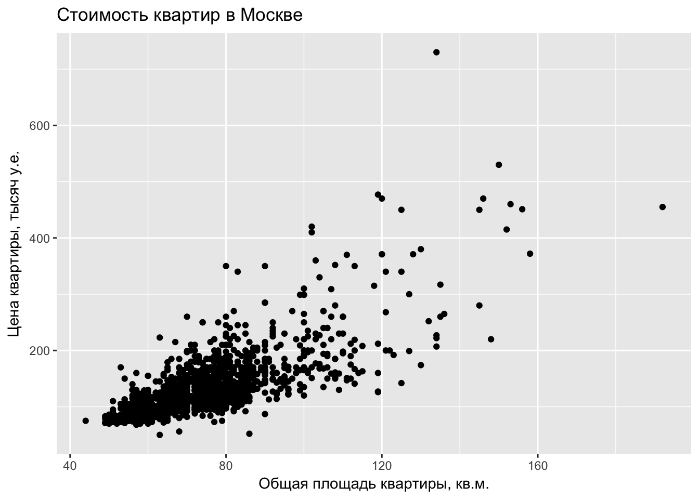
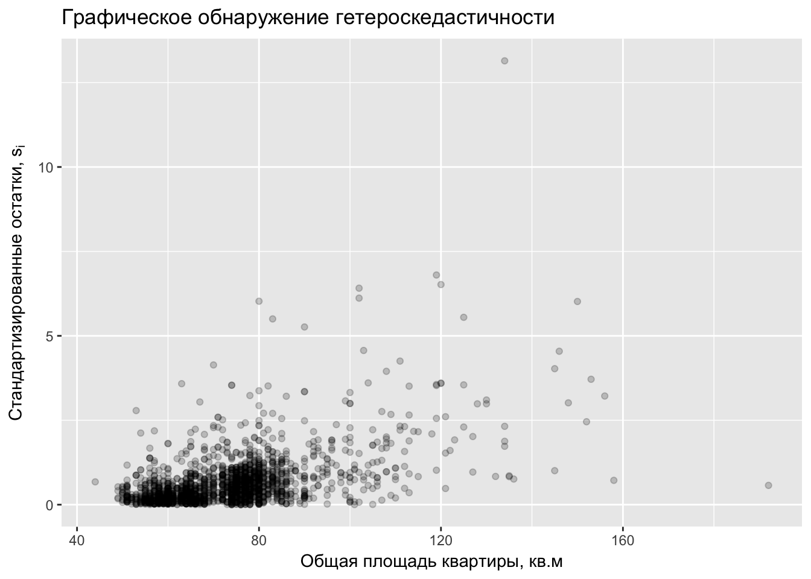

# Статистика и не только {#statistics_and_more}

Пора вспомнить о том, что R ориентирован на статистику :)

## Генерирование случайных величин {#random_variables}

Для решения задач по теории вероятностей или исследования свойств статистических алгоритмов может потребоваться сгененировать случайную выборку из заданного закона распределения.

Генерируем 10 равномерных на отрезке $[4;10.5]$ случайных величин:

```r
runif(10, min = 4, max = 10.5)
```

```
##  [1] 8.332251 8.577703 8.967174 4.404422 9.131656 9.887249 7.935560
##  [8] 5.599316 5.304904 4.092821
```

Генерируем 10 нормальных $N(2;9)$ случайных величин с математическим ожиданием $2$ и дисперсией $9=3^2$:

```r
rnorm(10, mean = 2, sd = 3)
```

```
##  [1]  2.9067083 -0.5496545  1.7926215  5.9895407  1.3112444  6.3808746
##  [7]  0.3957746  3.5054769  1.3545586 -0.1549924
```

Например, с помощью симуляций легко оценить математическое ожидание $E(1/X)$, где $X \sim N(2;9)$. Для этого мы вспомним Закон Больших Чисел. Он говорит, что арифметическое среднее по большой выборке стремится по вероятности и почти наверное к математическому ожиданию. Поэтому мы просто сгенерируем большую выборку в миллион наблюдений:


```r
n_obs <- 10^6
x <- rnorm(n_obs, mean = 2, sd = 3)
mean(1/x)
```

```
## [1] 0.1106875
```

Также легко оценить многие вероятности. Например, оценим вероятность $P(X_1 + X_2 + X_3^2 > 5)$, где величины $X_i$ независимы и одинаково распределены $X_i \sim U[0;2]$:

```r
n_obs <- 10^6
x_1 <- runif(n_obs, min = 0, max = 2)
x_2 <- runif(n_obs, min = 0, max = 2)
x_3 <- runif(n_obs, min = 0, max = 2)
success <- x_1 + x_2 + x_3^2 > 5
sum(success) / n_obs
```

```
## [1] 0.147307
```

Здесь вектор `success` будет содержать значение TRUE там, где условие `x_1 + x_2 + x_3^2 > 5` выполнено, и FALSE  там, где условие не выполнено. При сложении командой `sum()` каждое TRUE будет посчитано как единица, а каждое FALSE как ноль. Поэтому `sum(success)` даст количество раз, когда условие `x_1 + x_2 + x_3^2 > 5` выполнено.


С любым распределением `[xxx]` в R связано четыре функции: `r[xxx]`, `d[xxx]`, `p[xxx]` и `q[xxx]`. Для примера возьмём нормальное распределение $N(2;9)$:

- Функция для создания случайной выборки из нормального $N(2; 9)$ распределения — `rnorm`:

```r
x <- rnorm(100, mean = 2, sd = 3) # случайная выборка из 100 нормальных N(2; 9) величин
head(x, 10) # первые 10 элементов вектора
```

```
##  [1]  2.8133431  5.5480578 -3.4726572  0.5462824 -1.7972469 -5.1008670
##  [7]  1.6356092  3.9687793  4.4972188 -2.4802381
```

- Функция плотности — `dnorm`:

```r
x <- seq(from = -6, to = 10, length.out = 100)
y <- dnorm(x, mean = 2, sd = 3)
qplot(x = x, y = y, geom = "line") + xlab("Значения случайной величины $X$") + ylab("Функция плотности")
```


Для дискретных распределений с буквы `d` начинается название функции, возвращающей вероятность получить заданное значение. Найдём для случайной величины $W$, имеющей Пуассоновское распределение с параметром $\lambda = 2$ вероятность $P(W = 3)$:

```r
dpois(3, lambda = 2)
```

```
## [1] 0.180447
```


- Функция распределения, $F(t)=P(X\leq t)$ — `pnorm`:

```r
x <- seq(from = -6, to = 10, length.out = 100)
y <- pnorm(x, mean = 2, sd = 3)
qplot(x = x, y = y, geom = "line") + xlab("Значения случайной величины $X$") + ylab("Функция распределения")
```


- Квантильная функция или обратная функция распределения, $q(x) = F^{-1}(x)$ — `qnorm`:

Найдём перцентили 5\%, 15\% и 90\% для нормального $N(2; 9)$ распределения:

```r
x <- c(0.05, 0.15, 0.9)
qnorm(x, mean = 2, sd = 3)
```

```
## [1] -2.934561 -1.109300  5.844655
```

Иногда бывает полезно получить случайную выборку из заданного вектора без повторений:

```r
sample(1:100, size = 20)
```

```
##  [1]  30  67  55  21  95  23  83 100  73  97  36  63  11  33  75  91  27
## [18]  65  60  70
```


Или с повторениями:

```r
sample(c("Орёл", "Решка"), size = 10, replace = TRUE)
```

```
##  [1] "Решка" "Решка" "Орёл"  "Решка" "Орёл"  "Орёл"  "Орёл"  "Решка"
##  [9] "Орёл"  "Решка"
```

Можно добавить неравные вероятности:

```r
sample(c("Орёл", "Решка"), size = 10, replace = TRUE, prob = c(0.3, 0.7))
```

```
##  [1] "Орёл"  "Решка" "Орёл"  "Решка" "Решка" "Решка" "Орёл"  "Орёл" 
##  [9] "Орёл"  "Орёл"
```


Если выполнить команду `rnorm(10, mean = 2, sd = 3)` на двух разных компьютерах или два раза на одном и том же, то результат будет разный. Не зря же они случайные :) Однако генерирование случайных величин никак не противоречит идее абсолютно точной воспроизводимости исследований. Для того, чтобы получились одинаковые результаты, необходимо синхронизировать генераторы случайных чисел на этих двух компьютерах. Делается это путём задания **зерна** генератора случайных чисел (seed). Зерно также называют **стартовым значением**. В качестве зерна подойдёт любое целое число.

И в результате запуска кода

```r
set.seed(42)
rnorm(1, mean = 2, sd = 3)
```

```
## [1] 6.112875
```

все компьютеры выведут число $6.112875$.

<div class="warning">
<p>Если код содержит генерерирование случайных чисел, то необходимо задавать зерно генератора случайных чисел!</p>
</div>


## Базовые статистические тесты {#statistical_tests}

...

## Множественная регрессия {#classic_regression}

...

Эконометристы любят копаться в остатках :)

[https://www.r-bloggers.com/visualising-residuals/](https://www.r-bloggers.com/visualising-residuals/)


## Квантильная регрессия {#quantile_regression}

Незаслуженно забытой оказывается квантильная регрессия. Коэнкер (ссылка...) утверждает, что развитие эконометрики началось именно с квантильной регрессии. Для оценок квантильной регрессии не существует формул в явном виде, поэтому она проиграла классической регрессии среднего с готовой формулой $\hat\beta = (X'X)^{-1}X'y$. Сейчас компьютер позволяет начихать на отсутствие явных формул :)

...

## Инструментальные переменные {#instrumental_variables}

Каждый исследователь мечтает обнаружить не просто статистическую связь, а причинно-следственную. К сожалению, это не так просто. Записывая количество людей с зонтиками на улице и количество осадков но не зная физическую природу дождя, невозможно определить, вызывают ли люди с зонтиками дождь или наоборот. Для выяснения причинно-следственных связей необходим случайный эксперимент. Например, можно выбрать несколько случайных дней в году и выгнать толпу знакомых с зонтами на улицу, а затем посмотреть, было ли больше осадков в эти дни.

Использование инструментальных переменных не гарантирует нахождение причинно-следственной связи! Однако они могут быть полезны.

<div class="warning">
<p>Для обнаружения причинно-следственной связи необходимо либо использовать данные случайного эксперимента, либо прекрасно разбираться в закономерностях происходящего.</p>
</div>

Этот раздел не о том, как обнаружить причинно-следственную связь, а о том, как реализовать метод инструментальных переменных в R и как его проинтепретировать.


## Гетероскедастичность {#heteroskedasticity}

Подключаем нужные пакеты:

```r
library("ggplot2") # графики
library("sandwich") # оценка Var для гетероскедастичности
library("lmtest") # тест Бройша-Пагана
library("dplyr") # манипуляции с данными
```

Условная гетероскедастичность — $Var(\epsilon_i | x_i)\neq const$.


Последствия

* Нарушены предпосылки теоремы Гаусса-Маркова. Получаемые $\hat{\beta}_{ols}$ не являются эффективными.
* Несмещенность оценок $\hat{\beta}_{ols}$ сохраняется
* Нарушены предпосылки для использования $t$-статистик. При использовании стандартных формул $t$-статистики не имеют $t$-распределения. Доверительные интервалы и проверка гипотез по стандартным формулам даёт неверные результаты.

Что делать?

* Если нужны несмещенные оценки — ничего
* Если нужно проверять гипотезы или строить доверительные интервалы, то нужно использовать правильную формулу для $\widehat{Var}(\hat{\beta})$.
* Если нужны эффективные оценки и есть представление о том, какого вида может быть гетероскедастичность то можно взвесить наблюдения. Оценить регрессию:

\[
\frac{y_i}{\hat{\sigma}_i}=\beta_1 \frac{1}{\hat{\sigma}_i}+\beta_2 \frac{x_i}{\hat{\sigma}_i}+\frac{\epsilon_i}{\hat{\sigma}_i}
\]

* Задать другой вопрос: 
    + Вместо регрессии $y_i=\beta_1+\beta_2 x_i+\epsilon_i$ попробовать оценить регрессию $\ln(y_i)=\beta_1+\beta_2 \ln(x_i)+\epsilon_i$.
    + Оценить квантильную регрессию 

Файл с данными по стоимости квартир в Москве доступен по ссылке [goo.gl/zL5JQ](http://goo.gl/zL5JQ)


```r
filename <- "datasets/flats_moscow.txt"
flats <- read.table(filename, header = TRUE)


ggplot(flats) + geom_point(aes(x = totsp, y = price)) + 
  labs(x = "Общая площадь квартиры, кв.м.", y = "Цена квартиры, тысяч у.е.", 
  title = "Стоимость квартир в Москве")
```




Строим регрессию стоимости на общую площадь.

```r
m1 <- lm(price ~ totsp, data = flats)
summary(m1)
```

```
## 
## Call:
## lm(formula = price ~ totsp, data = flats)
## 
## Residuals:
##     Min      1Q  Median      3Q     Max 
## -120.58  -17.44   -3.56   10.99  444.52 
## 
## Coefficients:
##              Estimate Std. Error t value Pr(>|t|)    
## (Intercept) -62.04484    3.71178  -16.72   <2e-16 ***
## totsp         2.59346    0.04973   52.15   <2e-16 ***
## ---
## Signif. codes:  0 '***' 0.001 '**' 0.01 '*' 0.05 '.' 0.1 ' ' 1
## 
## Residual standard error: 33.96 on 2038 degrees of freedom
## Multiple R-squared:  0.5716,	Adjusted R-squared:  0.5714 
## F-statistic:  2719 on 1 and 2038 DF,  p-value: < 2.2e-16
```

Покажем доверительные интервалы для коэффициентов из регрессии.

```r
confint(m1)
```

```
##                  2.5 %     97.5 %
## (Intercept) -69.324117 -54.765570
## totsp         2.495927   2.690998
```

Посмотрим на $\widehat{Var}(\hat{\beta}|X)$.

```r
vcov(m1)
```

```
##             (Intercept)        totsp
## (Intercept)  13.7772925 -0.180775186
## totsp        -0.1807752  0.002473516
```

Если не хотим смотреть на всё summary, а только на то, что касается бет с крышкой.

```r
coeftest(m1)
```

```
## 
## t test of coefficients:
## 
##               Estimate Std. Error t value  Pr(>|t|)    
## (Intercept) -62.044844   3.711778 -16.716 < 2.2e-16 ***
## totsp         2.593462   0.049734  52.146 < 2.2e-16 ***
## ---
## Signif. codes:  0 '***' 0.001 '**' 0.01 '*' 0.05 '.' 0.1 ' ' 1
```


Как было сказано ранее: если в данных присутствует гетероскедастичность, но нужно проверить гипотезы и строить доверительные интервалы, то нужно использовать правильную оценку ковариационной матрицы, она выглядит так:
\[
\widehat{Var}_{HC}(\hat{\beta}|X)=(X'X)^{-1}X'\hat{\Omega}X(X'X)^{-1}
\]

\[
\hat{\Omega}=diag(\hat{\sigma}^2_1,\ldots,\hat{\sigma}^2_n)
\]

Есть разные способы состоятельно оценить отдельные дисперсии $\hat{\sigma}^2_i$, подробно можно почитать в описании пакета [`sandwich`](http://cran.r-project.org/web/packages/sandwich/vignettes/sandwich.pdf). Наиболее популярный на сегодня — это так называемый "HC3":
\[
\hat{\sigma}^2_i=\frac{\hat{\epsilon}_i^2}{(1-h_{ii})^2}
\] 

Здесь $h_{ii}$ — диагональный элемент матрицы-шляпницы (hat matrix), $\hat{y}=Hy$,  $H=X(X'X)^{-1}X'$. Матрицу-шляпницу также называют проектором, т.к. она проецирует вектор $y$ на линейную оболочку регрессоров.

Посмотрим на матрицу $\widehat{Var}_{HC}(\hat{\beta}|X)$ в R.

```r
vcovHC(m1)
```

```
##             (Intercept)       totsp
## (Intercept)  61.7662920 -0.89503034
## totsp        -0.8950303  0.01303563
```

Применяя правильную $\widehat{Var}_{HC}(\hat{\beta}|X)$, проверим гипотезы.

```r
coeftest(m1, vcov = vcovHC(m1))
```

```
## 
## t test of coefficients:
## 
##              Estimate Std. Error t value  Pr(>|t|)    
## (Intercept) -62.04484    7.85915 -7.8946 4.716e-15 ***
## totsp         2.59346    0.11417 22.7151 < 2.2e-16 ***
## ---
## Signif. codes:  0 '***' 0.001 '**' 0.01 '*' 0.05 '.' 0.1 ' ' 1
```

Доверительный интервал надо строить руками. За основу мы возьмем табличку с правильными стандартными ошибками и прибавим и вычтем их от оценок коэффициентов.

```r
conftable <- coeftest(m1, vcov = vcovHC(m1))
ci <- data_frame(estimate = conftable[, 1], 
                 se_hc = conftable[, 2],
                 left_95 = estimate - qnorm(0.975)*se_hc,
                 right_95 = estimate + qnorm(0.975)*se_hc)
ci
```

```
## # A tibble: 2 x 4
##     estimate     se_hc    left_95   right_95
##        <dbl>     <dbl>      <dbl>      <dbl>
## 1 -62.044844 7.8591534 -77.448501 -46.641186
## 2   2.593462 0.1141737   2.369686   2.817239
```

Ещё есть малоизвестный пакет `Greg` Макса Гордона и в нём есть готовая функция:

```r
Greg::confint_robust(m1)
```

Пакет `Greg` не доступен на официальном репозитории CRAN, ставится с `github` командой `devtools::install_github("gforge/Greg")`. Пакет `Greg` тянет за собой такую кучу всего, что не хочется его ставить ради одной функции. Здесь уместно упражнение: сделайте функцию `confint_robust` самостоятельно :)

В условиях гетероскедастичности обычная $t$-статистика не имеет ни $t$-распределения при нормальных $\varepsilon_i$, ни даже асимптотически нормального. И такая же проблема возникает с $F$-статистикой для сравнения вложенных моделей. Отныне привычная $F$-статистика 

\[
F=\frac{(RSS_R-RSS_{UR})/r}{RSS_{UR}/(n-k_{UR})}
\]

не имеет ни $F$-распределения при нормальных остатках, ни $\chi^2$-распределения асимптотически. В частности, для проверки незначимости регрессии в целом некорректно использовать $F$-статистику равную $F=\frac{ESS/(k-1)}{RSS/(n-k)}$. 


Если для теста Вальда использовать корректную оценку ковариационной матрицы, то его можно применять в условиях гетероскедастичности. Допустим, мы хотим проверить гипотезу $H_0$: $A\beta=b$, состоящую из $q$ уравнений, против альтернативной о том, что хотя бы одно равенство нарушено. Тогда статистика Вальда имеет вид:

\[
W = (A\beta - b)'(A\cdot \widehat{Var}_{HC}(\hat\beta)A')^{-1}(A\beta - b)
\]

и имеет асимптотически $\chi^2$-распределение с $q$ степенями свободы.

В R реализуется с помощью опции для команды `waldtest`. Покажем на примере гипотезы о незначимости регрессии в целом:

```r
m0 <- lm(price ~ 1, data = flats) # оцениваем ограниченную модель (регрессия на константу)
waldtest(m0, m1, vcov = vcovHC(m1))
```

```
## Wald test
## 
## Model 1: price ~ 1
## Model 2: price ~ totsp
##   Res.Df Df      F    Pr(>F)    
## 1   2039                        
## 2   2038  1 515.97 < 2.2e-16 ***
## ---
## Signif. codes:  0 '***' 0.001 '**' 0.01 '*' 0.05 '.' 0.1 ' ' 1
```


Переходим ко взвешенному МНК. Взвешенный МНК требует знания структуры гетероскедастичности, что редко встречается на практике. Предположим, что в нашем случае $Var(\epsilon_i | totsp_i) = const \cdot totsp_i$.

В R вектор весов `weights` должен быть обратно пропорционален дисперсиям, т.е. $w_i=1/\sigma^2_i$.

```r
m2 <- lm(price ~ totsp, weights = I(1 / totsp), data = flats)
summary(m2)
```

```
## 
## Call:
## lm(formula = price ~ totsp, data = flats, weights = I(1/totsp))
## 
## Weighted Residuals:
##     Min      1Q  Median      3Q     Max 
## -11.571  -1.994  -0.591   1.235  39.088 
## 
## Coefficients:
##              Estimate Std. Error t value Pr(>|t|)    
## (Intercept) -52.50302    3.53967  -14.83   <2e-16 ***
## totsp         2.46290    0.04931   49.95   <2e-16 ***
## ---
## Signif. codes:  0 '***' 0.001 '**' 0.01 '*' 0.05 '.' 0.1 ' ' 1
## 
## Residual standard error: 3.58 on 2038 degrees of freedom
## Multiple R-squared:  0.5504,	Adjusted R-squared:  0.5501 
## F-statistic:  2495 on 1 and 2038 DF,  p-value: < 2.2e-16
```


### Тесты на гетероскедастичность {#hetero_testing}

Графическое обнаружение гетероскедастичности:

* Оценивается исходная регрессия и из неё получаются остатки $\hat{\varepsilon}_i$.
* Если верить в гомоскедастичность, то дисперсия вектора остатков определяется по формуле $Var(\hat{\varepsilon}|X)=\sigma^2 (I-X(X'X)^{-1}X')$. Т.е. дисперсия у остатков разная (!) даже если $Var(\varepsilon_i|X)=\sigma^2$. Поэтому остатки стандартизуют по формуле:
\[
s_i = \frac{\varepsilon_i}{\sqrt{\hat{\sigma}^2(1-h_{ii})}}
\]
Остатки полученные после такого преобразования называют стандартизированными или иногда стьюдентизированными. 
* Можно построить график зависимости величины $s_i^2$ или $|s_i|$ от переменной, предположительно повинной в гетроскедастичности.

В R:

```r
m1.st.resid <- rstandard(m1) # получаем стандартизированные остатки
ggplot(aes(x = totsp, y = abs(m1.st.resid)), data =flats) + geom_point(alpha = 0.2) + 
  labs(x = "Общая площадь квартиры, кв.м", y = expression(paste("Стандартизированные остатки, ", s[i])),
  title = "Графическое обнаружение гетероскедастичности")
```



Иногда для простоты пропускают второй шаг со стандартизацией остатков и в результате могут ошибочно принять принять разную $Var(\hat{\varepsilon}_i)$ за гетероскедастичность, т.е. за разную $Var(\varepsilon_i)$. Впрочем, если гетероскедастичность сильная, то её будет видно и на нестандартизированных остатках.


### Тест Бройша-Пагана, Breusch-Pagan: {#hetero_bp_test}

Есть две версии теста Бройша-Пагана: авторская и современная модификация.

Предпосылки авторской версии:

* нормальность остатков, $\varepsilon_i \sim N(0,\sigma^2_i)$
* $\sigma^2_i=h(\alpha_1+\alpha_2 z_{i2}+\ldots+\alpha_{p}z_{ip})$
* у функции $h$ существуют первая и вторая производные
* тест асимптотический

Суть теста: Используя метод максимального правдоподобия посчитаем LM-статистику. При верной $H_0$ она имеет хи-квадрат распределение с $p-1$ степенью свободы.

Оказывается, что LM-статистику можно получить с помощью вспомогательной регрессии. Авторская процедура:

1. Оценивается регрессия $y_i=\beta_1+\beta_2 x_i +\varepsilon_i$
2. Переходим к $g_i=\frac{n}{SSR}\hat{\varepsilon_i}$
3. Строим регрессию $g_i$ на $\alpha_1+\alpha_2 z_{i2}+\ldots+\alpha_{p}z_{ip}$
4. $LM=\frac{ESS}{2}$


Современная модификация выглядит (неизвестный рецензент Коэнкера) так:

1. Оценивается регрессия $y_i=\beta_1+\beta_2 x_i +\varepsilon_i$
2. Оценивается регрессия $\hat{\varepsilon_i^2}$ на переменные вызывающие гетероскедастичность
3. При верной $H_0$ асимптотически:
\[
nR^2 \sim \chi^2_{p-1},
\]
где $p$ — число оцениваемых коэффициентов во вспомогательной регрессии. По смыслу $(p-1)$ — это количество факторов, от которых потенциально может зависеть дисперсия $Var(\varepsilon_i)$.

Тест Бройша-Пагана в R:

```r
bptest(m1) # версия Коэнкера
```

```
## 
## 	studentized Breusch-Pagan test
## 
## data:  m1
## BP = 201.95, df = 1, p-value < 2.2e-16
```

```r
bptest(m1, studentize = FALSE) # классика Бройша-Пагана
```

```
## 
## 	Breusch-Pagan test
## 
## data:  m1
## BP = 2366, df = 1, p-value < 2.2e-16
```

У современной модификации Бройша-Пагана более слабые предпосылки:

* $H_0$: $Var(\varepsilon_i)=\sigma^2$, нормальность не требуется
* $E(\varepsilon_i^4)=const$
* тест асимптотический
* (? Коэнкер в статье критикует что-то про мощность ?)


### Тест Уайта. White test {#white_test}

Предпосылки:

* $H_0$: $Var(\varepsilon_i)=\sigma^2$, нормальность не требуется
* $E(\varepsilon_i^4)=const$
* тест асимптотический

Процедура:

1. Оценивается регрессия $y_i=\beta_1+\beta_2 x_i +\varepsilon_i$
2. Строим регрессию $\hat{\varepsilon_i^2}$ на исходные регрессоры и их квадраты
3. Асимптотически $nR^2$ имеет хи-квадрат распределение

Тест Уайта в R: 

```r
bptest(m1, varformula = ~ totsp + I(totsp^2), data = flats)
```

```
## 
## 	studentized Breusch-Pagan test
## 
## data:  m1
## BP = 247.35, df = 2, p-value < 2.2e-16
```


Тест Уайта является частным случаем современной модификации теста Бройша-Пагана. В тесте Бройша-Пагана во вспомогательной регресии можно брать любые объясняющие переменные. В тесте Уайта берутся исходные регрессоры, их квадраты и попарные произведения. Если в R попросить сделать тест Бройша-Пагана и не указать спецификацию вспомогательной регрессии, то он возьмет только все регрессоры исходной.


### Тест Goldfeld-Quandt {#gq_test}

Предпосылки:

* нормальность остатков, $\varepsilon_i \sim N(0,\sigma^2_i)$
* Наблюдения упорядочены по возростанию гетероскедастичности
* тест точный (неасимптотический)

Процедура:

1. Упорядочить наблюдения в том порядке, в котором подозревается рост гетероскедастичности
2. Выкинуть некий процент наблюдений по середине, чтобы подчеркнуть разницу в дисперсии между начальными и конечными наблюдениями.
3. Оценить исходную модель по наблюдениям из начала выборки и по наблюдениям конца выборки
4. Получить, соответственно, $RSS_1$ и $RSS_2$

При верной $H_0$
\[
\frac{RSS_2}{RSS_1}\sim F_{r-k,r-k},
\]
где $r$ — размер подвыборки в начале и в конце.


Тест Голдфельда-Квандта в R:

```r
flats2 <- flats[order(flats$totsp), ] # сменим порядок строк в табличке h
m3 <- lm(price ~ totsp, data = flats2) 
gqtest(m3, fraction = 0.2) # проведем GQ тест выкинув посередине 20% наблюдений
```

```
## 
## 	Goldfeld-Quandt test
## 
## data:  m3
## GQ = 8.2121, df1 = 814, df2 = 814, p-value < 2.2e-16
## alternative hypothesis: variance increases from segment 1 to 2
```


### Тестирование и борьба с гетероскедастичностью {#hetero_fail}

Чайники часто используют такой *ошибочный* подход:

Протестировать гетероскедастичность. Если тесты выявили гетероскедастичность, то бороться с ней (использовать устойчивые стандартные ошибки или применять взвешенный мнк). Если тесты не выявили гетероскедастичность, то не бороться с ней.

Этот подход неверен!

Правильно делать так:

* Если есть теоретические основания ожидать гетероскедастичность и наблюдений достаточно, то использовать устойчивые стандартные ошибки вне зависимости от результатов тестирования.
* Если есть теоретические основания ожидать гетероскедастичность  и наблюдений мало, то отказаться от девичьих грёз об эффективности оценок и проверке гипотез. Довольствоваться возможной несмещенностью оценок.

Тут обычно спрашивают: "А зачем же тогда тестировать на гетероскедастичность, если это решение ни на что не влияет?". Ответ прост — чтобы узнать, есть ли гетероскедастичность. :) Впрочем, если есть теоретические основания её ожидать, то можно и не тестировать. 


### Прогнозирование при гетероскедастичности {#hetero_forecasting}

При прогнозировании строят доверительный интервал для среднего значения зависимой переменной и предиктивный интервал для конкретного будущего значения. С доверительным интервалом похоже надо код писать руками:

```r
# ...
```

С предиктивным интервалом чуть сложнее. Поскольку предиктивный интервал строиться для конкретного наблюдения, то нам надо знать дисперсию этого наблюдения. Идея робастных ошибок состоит в том, чтобы проверять гипотезы не делая точных предположений о структуре гетероскедастичности. Поэтому при использовании робастных стандартных ошибок традиционно предиктивные интервалы не строят.

Хм. А если взять парадигму рандомных регрессоров и оценку безусловной дисперсии?

Если же случилось чудо и структура гетероскедастичности доподлинно известна, то мы спокойно используем взвешенный МНК и указываем вес для новых наблюдений.

```r
# ...
```


### Дополнительно: {#hetero_links}

* [Описание пакета `sandwich`](http://cran.r-project.org/web/packages/sandwich/vignettes/sandwich.pdf) с очень правильным изложением современного взгляда на гетероскедастичность
* Breusch, Pagan, [Simple test for heteroskedasticity](http://www.jstor.org/stable/1911963)
* White, [A Heteroskedasticity-Consistent Covariance Matrix Estimator and a Direct Test for Heteroskedasticity](http://www.jstor.org/stable/1912934)
* Koenker, [A note on studentizing a test for heteroscedasticity](http://www.sciencedirect.com/science/article/pii/0304407681900622)


## Работа с качественными переменными {#factor_variables}

...


## Логит и пробит с визуализацией {#logit_probit}

...


## Метод главных компонент {#pca}

...


## Мультиколлинеарность {#multicollinearity}

...


## LASSO {#lasso}


Оказывается, что оценки LASSO для всех значений параметра $\lambda$ можно получить очень быстро! Для этого нам потребуется алгоритм LARS (Least Angle Regresssion):

1. Положим стартовые значения всех $\beta_j$ равными нулю.

1. Найдём регрессор $x_j$ сильнее всего коррелированный с $y$ по модулю

1. Изменяем коэффициент $\beta_j$ в направлении знака корреляции $x_j$ и $y_j$. Попутно считаем остатки $\hat u = y - \hat y$. Прекращаем изменять коэффициент $\beta_j$, как только некоторый регрессор $x_k$ будет настолько же сильно коррелирован с $r$ как $x_j$

1. Увеличиваем пару $(\beta_j, \beta_k)$ в направлении задаваемом линейной регрессией, до тех пор пока у некоторого $x_m$ не будет высокой корреляции с $r$

1. Если ненулевой коэффициент уходит в ноль, то выкидываем его из множества активных регрессоров.

1. Продолжаем до тех пор, пока все регрессоры не вошли в модель.


## Метод максимального правдоподобия {#maximum_likelihood}

...


## Метод опорных векторов {#svm}

...


## Случайный лес {#random_forest}

...


## Экспоненциальное сглаживание {#exponential_smoothing}

...


## ARMA модели {#arma}

...


## GARCH {#garch}

...


## VAR и BVAR {#var_bvar}

...


Я не верю в пользу от структурных BVAR, поэтому их здесь нет :)

## Панельные данные {#panel_data}

...


## Байесовский подход: первые шаги {#bayesian_first_steps}

...


## Байесовский подход: STAN {#stan}

...


## Карты {#maps}

> Где карта, Билли?

## Дифференциальные уравнения {#differential_equations}

...


## Задачи оптимизации {#optimisation}

...

